# Agent 工具/上下文/RAG 重构 — 优化方案与执行计划

> 本文是 **可执行计划**，整合三份审查文档的结论并补齐其缺口。  
> 输入：[AGENT_TOOLS.md](./AGENT_TOOLS.md)（现状）、[AGENT_TOOLS_REFACTOR_ISSUES.md](./AGENT_TOOLS_REFACTOR_ISSUES.md)（问题）、[AGENT_API_TOOLS_CONTEXT_ANALYSIS.md](./AGENT_API_TOOLS_CONTEXT_ANALYSIS.md)（合理性 + 续排查）。  
> 状态：规划稿，尚未改生产代码。

---

## 0. 目标、范围与原则

### 0.1 北极星指标

| 指标 | 现状（估） | 目标 | 度量方式 |
|------|-----------|------|----------|
| 单工具最终失败率 | 高（无准确埋点） | < 5% | `metrics.record_tool_result` 改造后按 error_code 统计 |
| 「假成功」事件数 | 未知 | → 0 | 流式/记忆 persist 失败回灌计数 |
| 同一工具单轮重试次数 P95 | ≥3 | ≤1 | SSE attempt 埋点 |
| 用户可见原始 JSON 行 | 偶发 | 0 | 前端快照测试 |
| 写章后 SearchKnowledge 命中新章 | 不保证 | 明确「索引中」提示 | reindex 状态 API |

### 0.2 范围

- **In**：`python-ai/app/agent/*`、`python-ai/app/rag/*`、novel-studio `studio-module-content`/`studio-module-agent`、`frontend` 时间线展示。
- **Out**：模型选型、计费、爬虫子系统、客户端加密（除非阻塞）。

### 0.3 原则

1. **单一真值**：工具「成功」必须等于远端持久化成功（或显式标记 pending）。
2. **失败必回灌**：任何失败都要进模型上下文（结构化 error_code）且对用户可见（attempt）。
3. **上下文随写失效**：mutation 后强制 catalog 失效，下一步用真值。
4. **schema 越简单越好**：减少定位方式与行为分支，宁可服务端兜底也不让 LLM 猜。
5. **灰度可回滚**：每阶段 feature flag 包裹，异常可秒切回旧路径。

---

## 1. 审查文档缺口补充（本文新增）

审查文档侧重「问题诊断」，以下工程化要素需补齐，已纳入计划：

| 缺口 | 补充内容 | 落在阶段 |
|------|----------|----------|
| **灰度策略** | 每项改动用 env flag；默认旧行为，逐 flag 放量 | 全程，见 §6 |
| **契约测试** | Python↔Java Content API 的 schema 契约测试（pact-style 或共享 fixtures） | Phase 2 |
| **幂等键** | 章节 create/update、memory delete 引入 `Idempotency-Key`，解决重试重复建章/删除 400 | Phase 2 |
| **catalog version** | `chapters` 列表带 `etag`/`rev`；RUN_CONTEXT 注入 version；写带 `If-Match` | Phase 1 + 2 |
| **监控指标定义** | error_code 维度、attempt 直方图、假成功计数、索引滞后 | Phase 0 |
| **回归基线** | 落地前抓取 N 个真实 run 作金标准回放 | Phase 0 |
| **数据迁移** | catalog rev 字段、memory cold 一致性修复脚本 | Phase 2/3 |
| **端到端验收** | 线上场景脚本（写书→改章→审查→检索） | 每阶段 Exit |

---

## 2. 优先级与阶段总览

按 **数据正确性 > 失败可恢复 > 复杂度 > 体验** 排序。阶段可并行的已标注。

```mermaid
gantt
    title 重构里程碑（相对周）
    dateFormat  X
    axisFormat %s
    section P0 地基
    可观测+回归基线        :p0, 0, 1
    section P1 真值
    流式写章真值           :p1a, after p0, 2
    上下文随写失效         :p1b, after p0, 2
    Agent并发收敛          :p1c, after p0, 1
    section P2 契约
    Content agent子路由     :p2a, after p1a, 2
    幂等键+catalog rev      :p2b, after p1b, 2
    错误协议统一           :p2c, after p1a, 1
    section P3 语义
    Edit工具重构           :p3a, after p2a, 2
    Search/Memory简化       :p3b, after p2c, 2
    section P4 体验
    前端ToolStepView        :p4, after p2c, 2
    section P5 架构
    KG外置+搜索合一         :p5, after p3a, 3
```



| 阶段 | 主题 | 风险 | 依赖 | 对应审查 |
|------|------|------|------|----------|
| **P0** | 可观测 + 回归基线 + flag 框架 | 低 | — | ISSUES Phase A |
| **P1** | 流式写章真值 / 上下文失效 / Agent 并发 | 中 | P0 | ANALYSIS §八/§十 |
| **P2** | Content agent 子路由 / 幂等 / catalog rev / 错误协议 | 中高 | P1 | ISSUES Phase C, ANALYSIS §十一 |
| **P3** | Edit 工具重构 / Search & Memory 简化 | 高 | P2 | ANALYSIS §二 |
| **P4** | 前端 ToolStepView + 阶段 i18n | 中 | P2 | TOOLS §10.4 |
| **P5** | KG 外置 / 搜索栈合一 | 高 | P3 | ANALYSIS §四 |

---

## 3. 分阶段执行计划

每项格式：**问题 → 方案 → 改动文件 → 验收 → 回滚**。

### Phase 0 — 可观测与地基（1 周，低风险）

#### 0.1 工具指标重构

- **问题**：`metrics.record_tool_result` 按每次 `run_tool_use` 计数，静默重试污染，无 error_code 维度。
- **方案**：
  - 增加维度：`tool`、`error_code`、`is_final`（区分中间重试与最终结果）、`attempt`。
  - 仅最终结果计入失败率；中间重试单独直方图。
- **改动**：`python-ai/app/agent/metrics.py`、`tool_execution.py`（传 attempt/is_final）。
- **验收**：本地跑测试，metrics 输出含 error_code；失败率 = 最终失败 / 总调用。
- **回滚**：metrics 为旁路，删除新字段即可。

#### 0.2 结构化 ToolError 协议（先定义，不强制）

- **问题**：错误回灌为裸 `<tool_use_error>英文</tool_use_error>`，模型难判断下一步。
- **方案**：定义 `ToolError` dataclass：
  ```python
  ToolError(code: str, message: str, hint: str|None,
            suggested_tools: list[str], resource: dict|None, retryable: bool)
  ```
  - `code` 枚举：`OLD_STRING_NOT_FOUND`、`CHAPTER_NOT_FOUND`、`AMBIGUOUS_TITLE`、`INDEX_OUT_OF_RANGE`、`MEMORY_ITEM_NOT_FOUND`、`SCHEMA_INVALID`、`UPSTREAM_5XX`、`INDEXING_PENDING` 等。
  - 序列化为模型正文：`<tool_use_error code=... hint=...>message</tool_use_error>`。
- **改动**：新增 `python-ai/app/agent/tools/errors.py`；`tool.py` 增 `ToolCallResult.error: ToolError|None`。
- **验收**：单测覆盖序列化；暂不改各工具（Phase 2 接入）。
- **回滚**：未被引用，无副作用。

#### 0.3 回归基线

- **问题**：无金标准，重构后难判断回归。
- **方案**：抓取 10–20 个真实 run 的 SSE 序列 + 最终 DB 状态作 fixture；新增回放断言脚本。
- **改动**：`python-ai/tests/fixtures/runs/*.jsonl`、`tests/test_run_replay.py`。
- **验收**：基线全绿。
- **回滚**：纯测试。

#### 0.4 Feature flag 框架

- **方案**：`config.py` 增加一组 `AGENT_RF_*` 开关（默认旧行为）：
  | flag | 控制 |
  |------|------|
  | `AGENT_RF_STREAM_TRUTH` | 流式写章真值（P1.1） |
  | `AGENT_RF_CATALOG_VERSION` | catalog 失效/version（P1.2） |
  | `AGENT_RF_AGENT_SERIAL` | Agent 串行（P1.3） |
  | `AGENT_RF_ERROR_PROTOCOL` | ToolError 接入（P2.3） |
  | `AGENT_RF_NEW_TIMELINE` | 前端新 UI（P4） |
- **改动**：`python-ai/app/config.py`、`frontend` env。

---

### Phase 1 — 数据真值（2 周，中风险）

#### 1.1 流式写章真值（Critical，flag: `AGENT_RF_STREAM_TRUTH`）

- **问题**（ANALYSIS §八）：finalize 假成功；新章 `chapter_id` 不回填导致重复 POST；`_run_once` 丢弃中间版本；失败不进 `chapter_persist_failures`。
- **方案**：
  1. `StreamingChapterAppender` 持有 `asyncio` 同步点；**persist 成功回写 `chapter_id`** 到 appender，后续 flush 走 PUT。
  2. `_run_once` 改为 **coalesce**：执行中再来同 key → 记 pending latest，执行完补跑最新；不丢弃。
  3. `finalize` **等待** 最后一次 persist 结果；失败时返回真实 `err` 并写 `chapter_persist_failures`，触发 loop 恢复 HumanMessage。
  4. 空壳 `schedule_start` 取消（或改为「占位但不 POST」）。
- **改动**：`chapter_stream_persist.py`、`async_content_persist.py`、`chapter_stream_bridge.py`、`chapter_stream.py`、`loop.py`（恢复分支覆盖流式）。
- **验收**：
  - 集成测：流式写章 → 模拟 persist 失败 → 模型收到失败回灌；成功 → 仅一条章节、id 稳定。
  - 回归基线无重复建章。
- **回滚**：flag off 走旧 fire-and-forget。

#### 1.2 上下文随写失效（flag: `AGENT_RF_CATALOG_VERSION`）

- **问题**（ANALYSIS §三/§十一.6）：WriteChapter 后 patch 含 chapters 即跳过 API refresh；WriteMemory 后不 refresh story_memory；`_MEMORY_TOOLS` 用已删 VFS 名；`retrieved_context` 死字段。
- **方案**：
  1. 引入 `ctx.catalog_rev`（int/etag）；任何 chapter/memory mutation 设 `catalog_stale=True`。
  2. 下一工具 step 前若 `catalog_stale`，**强制** `fetch_chapter_summaries` / memory catalog pull。
  3. `enrich.py`：`_MEMORY_TOOLS` 改为 `{ReadMemory, WriteMemory, EditMemory, DeleteMemory, ClearMemory}`；WriteMemory 后 `refresh_story_memory=True`。
  4. 删除 `retrieved_context` 死读取（`plan_context.py`、`routing.py`），或接入 SearchKnowledge 缓存（择一，建议先删）。
- **改动**：`schemas.py`（ctx 字段）、`loop.py`（891 行刷新条件）、`enrich.py`、`plan_context.py`、`routing.py`。
- **验收**：WriteMemory→ReadMemory 一致；WriteChapter→下一轮 catalog 为 DB 真值。
- **回滚**：flag off 保留旧条件刷新。

#### 1.3 Agent 并发收敛（flag: `AGENT_RF_AGENT_SERIAL`）

- **问题**（ANALYSIS §十.2）：`Agent` 标 `concurrency_safe=True`，多 Agent 并行 + 与 Read 同批 → 竞态。
- **方案**：
  1. `interaction.py` 的 `Agent` 改 `is_concurrency_safe=lambda _i: False`。
  2. `partition_tool_calls`：mutating 工具与 `Agent` 独占批；Read 不与 Agent 合批。
  3. 子 Agent 结束强制 `refresh_chapters_from_content_api` 后再返回父 ToolMessage（补 §十.3 回传缺口的最小修）。
- **改动**：`interaction.py`、`tool_orchestration.py`、`subagent_sse.py`。
- **验收**：测试 `test_partition_*` 更新为 Agent 不合批；并行写章竞态用例消失。
- **回滚**：flag off 恢复 safe=True。

---

### Phase 2 — API 契约与错误协议（2 周，中高风险）

#### 2.1 Content agent 专用子路由

- **问题**（ANALYSIS §一/§十一）：camelCase/snake 混用；读格式双轨；session 无 clear；PUT 404→POST 幽灵章。
- **方案**：新增 `/api/content/auth/agent/*`（snake_case 统一）：
  - `GET /agent/novels/{id}/chapters`（带 `rev`/etag）
  - `GET /agent/chapters/{id}`（**单一格式**：raw + metadata；行号在工具层加）
  - `PUT /agent/chapters/{id}`（支持 `If-Match: rev`，冲突 409 + 新 catalog）
  - `POST /agent/sessions/{id}/story-memory/clear`（补缺口）
  - 结构化 4xx：`{error_code, message, field, hint}`。
- **改动**：novel-studio 新 controller + biz 复用；python-ai `content_api.py`/`chapter_store.py`/`story_memory_content.py` 指向新路由。
- **验收**：契约测试通过；旧路由保留兼容。
- **回滚**：python-ai 客户端 base path 配置切回旧路由。

#### 2.2 幂等键 + catalog rev

- **问题**（ANALYSIS §十一.1/.4）：create/update 无幂等；delete memory not-found 返回 400。
- **方案**：
  - 写章/写记忆请求带 `Idempotency-Key`（run_id+tool_call_id）；服务端去重返回首次结果。
  - DELETE 章节/记忆 not-found → 返回幂等成功（`{ok:true, already_absent:true}`）。
  - reorder：要求全量 id 或服务端补全 + 去重校验，409 返回真实顺序。
- **改动**：novel-studio `ChapterService`/`StoryMemoryService`/controllers；python-ai 客户端传 key。
- **验收**：重试同请求不产生重复；delete 重试不报错。
- **回滚**：忽略 Idempotency-Key 头即退化为旧行为。
- **落地补记（2026-06-17，JDK21+mvn 本地编译通过）**：
  - `ChapterService.deleteChapter` 改为**幂等**——not-found 返回 `false`（不再 throw），`AuthChapterBiz.delete` 回 `{ok:true, already_absent:bool}`；DELETE 重试 200 而非 404，python `delete_chapter` 走成功分支。
  - 复核：novel-scoped story-memory `/clear` **已存在**（`AuthNovelStoryMemoryController`），agent 走 novel 作用域，故"session 无 clear"对 agent 路径**无缺口**。
  - **缓做（marginal value，需线上部署验收）**：snake_case 子路由全量改造、catalog `rev`/`If-Match`、create `Idempotency-Key` 去重存储——因 python 侧 P1.1（`chapter_id` 回填防重复 POST）+ P1.2（强制 catalog 刷新）已覆盖主要"重复建章/读脏"风险，收益有限，留待与 P5 reindex 状态一并做。

#### 2.3 错误协议接入（flag: `AGENT_RF_ERROR_PROTOCOL`）

- **问题**（ISSUES §一）：错误回灌不结构化；静默重试与 turn 恢复矛盾；分类器引用已删工具名；Exception 一律标 recoverable。
- **方案**：
  1. 各工具失败返回 `ToolError`（P0.2 定义），`code`+`hint`+`suggested_tools`。
  2. `classify_tool_step_failure`：基于 `error_code` 而非英文子串；删除 `chapter_create` 等死分支与 `RETRYABLE_TOOLS` VFS 名。
  3. 修 `loop.py` 813：`silent_retry_attempts>0` 最终失败仍应 `turn_recoverable_failure`。
  4. `run_tool_use`：区分 `SCHEMA_INVALID`（可 repair）与 `UPSTREAM/LOGIC`（不空转）；repair 失败不再注入无效 `_tool_retry`。
  5. SSE `step.failed` 带 `error_code`/`attempt`（仅 UI）。
- **改动**：`errors.py`、`chapter.py`、`memory.py`、`knowledge.py`、`tool_execution.py`、`loop.py`、`loop_support.py`、`run_tool_use.py`、`events.py`。
- **验收**：错误回灌含 code/hint；同错不空转；指标按 code 分布。
- **回滚**：flag off 走旧字符串错误。
- **落地补记（2026-06-17）**：loop「自动重排可恢复集」`_LOOP_RECOVERABLE_CODES` 刻意收窄为**输入可修复**类（`OLD_STRING_NOT_FOUND`/`SCHEMA_INVALID`/`AMBIGUOUS_TITLE`/`INDEX_OUT_OF_RANGE`/`MEMORY_ITEM_NOT_FOUND`）+ legacy `memory_op`/`empty_chapter_body`；`CHAPTER_NOT_FOUND`/`UPSTREAM_5XX`/`CONFLICT`/`INDEXING_PENDING` 保持**致命**（结构化 code 仍随 ToolMessage 进模型，但不触发无界重排，避免 stubborn 模型重试风暴）。`474 passed`（1 个 `test_kg_query` 失败属既有 KG 改动，与本次无关）。

---

### Phase 3 — 工具/API 语义简化（2 周，高风险）

#### 3.1 EditChapter 重构

- **问题**（ANALYSIS §二.2）：old_string 精确匹配 fragile；一个工具承担编辑/重命名/移动/局部替换。
- **方案**：
  - 默认路径 **整章替换**（`new_content`）；保留可选 `patch_ops`（结构化段替换）替代 old_string。
  - 重命名/移动拆到 `EditChapter` 的明确字段（title/position），不再混 old_string。
  - 失败回 `OLD_STRING_NOT_FOUND` + hint `ReadChapter(chapter_id)`。
- **改动**：`schemas.py`、`chapter.py`、`text_edit.py`、提示词。
- **验收**：Edit 失败率显著下降；回归基线改写场景通过。
- **回滚**：保留旧 old_string 入口一个版本（兼容）。
- **落地补记（2026-06-17）**：`EditChapterInput` 新增 `new_content`（首选整章替换，无脆弱匹配）与 `new_title`（重命名，此前不可改名）；`edit_chapter` 支持「仅改名/仅移动」无正文补丁，缺任何编辑意图回 `SCHEMA_INVALID`，old_string 失配回 `OLD_STRING_NOT_FOUND`+ReadChapter hint；流式重写改走 `new_content`。新增 `tests/test_edit_chapter_semantics.py`（6 例）。`480 passed`（仅既有 KG 测试无关失败）。

#### 3.2 SearchKnowledge / Memory 简化

- **方案**：
  - SearchKnowledge 去掉模型侧 `mode`，默认 hybrid；graph 作内部增强；空结果区分 `无匹配` / `INDEXING_PENDING`。
  - WriteMemory 接受 markdown/plain，服务端转 envelope；EditMemory 补 `context_patch` + async 标记，与 Write 对齐。
  - ListMemory 写 `memory_catalog` patch。
- **改动**：`knowledge.py`、`memory.py`、`schemas.py`、`story_memory*.py`。
- **验收**：WriteMemory 不再因 JSON 报 SCHEMA_INVALID；Search 空结果语义清晰。
- **回滚**：flag/版本兼容。
- **落地补记（2026-06-17）**：`SearchKnowledge` 去掉模型侧 `mode`（单一 hybrid，graph 走 `GetCharacterGraph`），空结果回 `{status: no_match, hint}`（INDEXING_PENDING 真值待 P5 reindex 状态 API）；`WriteMemory.payload` 接受 `dict | str`，纯文本/markdown 走 `write_memory_json` 不再误报 SCHEMA_INVALID；`EditMemory` 两条成功路径补 `last_memory_patch`+`memory_async`；`ListMemory` 输出 `memory_catalog` patch。新增 `tests/test_memory_tool_semantics.py`（5 例）+ 重写 `test_search_knowledge_tool.py`（2 例）。`485 passed`（仅既有 KG 测试无关失败）。

---

### Phase 4 — 前端时间线统一（2 周，中风险，flag: `AGENT_RF_NEW_TIMELINE`）

- **依据**：[AGENT_TOOLS.md §10.4](./AGENT_TOOLS.md)。
- **方案**：
  1. `toolTitleI18n.ts`：`resolveToolTitle(tool, phase)` + `inferToolTitlePhase`；`editor.json` 增 `toolTitles.{Tool}.{started|running|runningStream|done|failed}`（zh/en）。
  2. `toolUiFormatters.ts`：每工具 `formatInputForUi` / `formatOutputForUi`；禁 JSON fallback。
  3. `ToolStepView.tsx` 替换 `CcToolRow` 默认分支；扫光仅 running 标题；AskUser/Agent 保留专用布局。
  4. `agentStreamState.ts` 停止重复写 `displayExcerpt`+`toolOutputDetail`+`outputSummary`；删除 `toolDetailFormat.ts` 的 `JSON.stringify` fallback。
- **验收**：Playwright 断言无 `{` 开头工具行、无裸 UUID；阶段标题随状态变化。
- **回滚**：flag off 走旧 `CcToolRow`。
- **落地补记（2026-06-17，vitest 7/7 + tsc 本文件 0 err）**：`toolDetailFormat.formatToolInputFromPayload` **删除 `JSON.stringify` fallback**（北极星「用户可见原始 JSON 行 → 0」），新增 `EditChapter.new_content/new_title`、`WriteMemory.payload(纯文本)`、`scope/key/query/character/position/index` 的人读渲染；无匹配键时退化为 `key: value` 标量行（绝不吐裸 JSON / 引号 / 花括号），无标量则 `undefined`。`toolDetailFormat.test.ts` 加 4 例。**仍待办**：`toolTitleI18n.resolveToolTitle(tool,phase)`、`ToolStepView` 替换 `CcToolRow` 默认分支、阶段标题 i18n（zh/en `toolTitles.*`）、`agentStreamState` 去重 displayExcerpt/outputDetail/outputSummary。
- **构建解阻（2026-06-17，`tsc --noEmit` exit 0）**：修掉 4 个既有 WIP TS 错——`attachRecoveryRef` ref 类型补 `force?: boolean`（函数本就支持，仅类型注解过期）、移除未用 `isHostDetachMessage` 导入、`KnowledgeGraphMini.layoutNodes` 未用形参改 `_edges`。
- **P4b 加固**：标量兜底排除 id 类键（`/^id$|_id$|uuid|tool_call_id/i`）→ 北极星「无裸 UUID」；`toolDetailFormat.test.ts` 共 **8 例**全过。
- **P4a 落地（2026-06-17，vitest 9/9 + tsc 0 err）**：新增 `frontend/src/utils/toolTitleI18n.ts`（`inferToolTitlePhase(phase,{active,streaming})` → `started|running|runningStream|awaiting|done|failed`；`resolveToolTitle(tool,phase)` 按**原始工具 API 名**查 `editor:(timeline|chat.timeline).toolTitles.{Tool}.{phase}`，含 runningStream→running / awaiting→running 回退，未命中退回 `translateToolDisplayName`）。`editor.json` zh/en 在 `timeline` 块下新增 `toolTitles`（17 个工具 × running/done/failed，WriteChapter/EditChapter 另含 runningStream，AskUser 含 awaiting）。`CcToolRow` 接入：用 `iconName`（英文 API 名，**不可** `normalizeToolName`，否则 WriteChapter/WriteMemory 都塌成 Write）解析阶段标题，命中则标题随状态变化并在 running 时扫光、**抑制冗余 phase chip**；未命中**优雅回退**到原「name · phase」，故对作者 i18n WIP **零回归**。`toolTitleI18n.test.ts` 9 例（注入受控 bundle，隔离 json 迁移）。
- **i18n 现状提示（作者 WIP）**：`editor.json` 的 `timeline` 现为**根级键**（`editor:timeline.phaseRunning` 可解析），但 `orchestrationI18n.ts` 仍引用 `editor:chat.timeline.*`（当前**不解析**）。`resolveToolTitle` 已双前缀兼容；建议作者统一二选一（推荐把 orchestrationI18n 改回 `editor:timeline.*`）。
- **i18n 根因修复（2026-06-17，全量 vitest 350/350 + tsc 0 err）**：核实 `editor.json`（HEAD 与工作树一致）`timeline` 实为**根级键**（`editor:timeline.*` 可解析），而 `orchestrationI18n.ts`/`agentToolStats.ts` 长期误用 `editor:chat.timeline.*`（**从不解析的潜伏 bug**，阶段/编排标题与工具统计 i18n 此前实为失效）。已统一改为 `editor:timeline.*`（11+1 处），`toolTitleI18n` 同步收敛为单前缀 `editor:timeline.toolTitles`。
- **顺带修复作者 WIP 既有测试红**：`buildAgentHistory.ts` WIP 误加 `agentThinkText` 兜底→泄漏推理进 assistant 历史，违反**已提交**测试 `buildAgentHistory.test.ts`「不得用 thinkText 作历史正文」；已移除该兜底，语义正确（推理不回放为助手轮）。
- **P4c 决策（缓做/部分被取代）**：
  - `ToolStepView` 新组件**已被取代**——`CcToolRow` 经 P4a/P4b 增强后已满足北极星（阶段标题随状态变化、无裸 JSON、无裸 UUID），再起平行组件只会重复。
  - `agentStreamState` 去重 `displayExcerpt/toolOutputDetail/outputSummary`：位于核心 reducer `applyAgentEvent`（30 例测试 + `TimelineToolBlock` 多字段优先级消费），改字段语义有真实回归风险，**需 E2E 验收**（作者已要求延后统一验收）→ 留待 P4d Playwright 一并做。
- **运行提示**：本机跑 `npx vitest`/`npx tsc`/`node`/`mvn` 需带**网络权限**，否则沙箱内会静默挂起（返回 no exit status）。

---

### Phase 5 — 架构（3 周，高风险）

- **KG 外置**：进程内内存图 → Redis/Neo4j，解决多 worker 不一致；写章索引后同步抽取状态可查。
- **搜索栈合一**：Java `/novels/{id}/search` 与 Python Milvus 文档化为单一入口；大书 BM25 改为持久化倒排或移除。
- **索引一致性**：`ChapterIndexClient` 失败计数 + `GET /agent/.../reindex/status`，SearchKnowledge 联动返回 `INDEXING_PENDING`。
- **MQ 可靠性**：StoryMemory 消费失败进 DLQ + 重试；cold patch 带序号防乱序覆盖。
- **回滚**：分服务灰度，KG/搜索独立 flag。

---

## 4. 跨阶段验收矩阵

| 场景 | P1 后 | P2 后 | P3 后 |
|------|-------|-------|-------|
| 流式写一章后立即改章 | id 稳定、可改 | 409 冲突可恢复 | old_string 失败可读回重试 |
| 连续 WriteMemory 同 key | 不丢更新 | 幂等 | markdown 直接写 |
| 并行让两个子 Agent 写章 | 串行执行无竞态 | — | — |
| 写章后 SearchKnowledge | catalog 真值 | — | 明确「索引中」 |
| 工具失败 | 回灌可恢复 | error_code 分类 | hint 引导正确下一步 |

---

## 5. 测试策略

| 层 | 内容 |
|----|------|
| 单元 | ToolError 序列化、classify_tool_step_failure（code 维度）、_run_once coalesce |
| 集成 | 流式 persist 失败回灌、catalog 失效刷新、Agent 串行分区 |
| 契约 | Python 客户端 ↔ Java agent 子路由 schema（共享 fixtures） |
| 回放 | P0 金标准 run，每阶段回归 |
| E2E | 线上场景脚本：建书→写3章→改1章→审查→检索 |
| 前端 | Playwright 时间线快照、无 JSON、阶段标题 |

---

## 6. 灰度与回滚

1. 每阶段 flag 默认 **off**（旧行为）。
2. 本地 + 预发开 flag 跑回归基线与 E2E。
3. 线上按 worker 灰度（python-ai 单实例先开）。
4. 监控 §0.1 指标 24h 无回退再全量。
5. 异常：flag off 秒切；DB 改动（catalog rev/幂等表）保持向后兼容，不删旧列。

---

## 7. 风险登记

| 风险 | 等级 | 缓解 |
|------|------|------|
| 流式真值改造引入写章延迟 | 中 | persist 异步但 finalize 仅等最后一次；超时降级 pending 标记 |
| catalog 强制刷新增加 API 压力 | 中 | rev/etag 命中则跳过；TTL 1s 合并 |
| Agent 串行降低吞吐 | 低 | 仅 mutating 串行，只读仍并行 |
| Java 新子路由与旧路由分叉 | 中 | 共享 biz 层；契约测试守护 |
| 前端大改回归 | 中 | flag + Playwright 基线 |

---

## 8. 交付物清单

- [x] P0：metrics 改造、`errors.py`、flag 框架（回归基线待真实 run 数据）
- [x] P1：流式真值、catalog 失效、Agent 串行
- [~] P2：agent 子路由（2.1，部分/缓做）、幂等键（2.2，删除幂等已落地，create Idempotency-Key 缓做）、[x] 错误协议接入（2.3）
- [x] P3：EditChapter 重构（3.1）、Search/Memory 简化（3.2）
- [ ] P4：ToolStepView + 阶段 i18n
- [ ] P5：KG 外置、搜索合一、索引一致性、MQ DLQ
- [ ] 各阶段：契约/回放/E2E 绿 + 指标达标

---

## 9. 与现有文档关系

| 文档 | 角色 |
|------|------|
| [AGENT_TOOLS.md](./AGENT_TOOLS.md) | 现状是什么 + 目标 UI 规范（§10.4） |
| [AGENT_TOOLS_REFACTOR_ISSUES.md](./AGENT_TOOLS_REFACTOR_ISSUES.md) | 问题清单（四类） |
| [AGENT_API_TOOLS_CONTEXT_ANALYSIS.md](./AGENT_API_TOOLS_CONTEXT_ANALYSIS.md) | 合理性分析 + 续排查（异步/重试/并发/安全） |
| **本文** | **怎么改、按什么顺序、如何验收回滚** |

---

*执行计划稿，2026-06-17；落地前以 flag 灰度，未改生产代码。*
