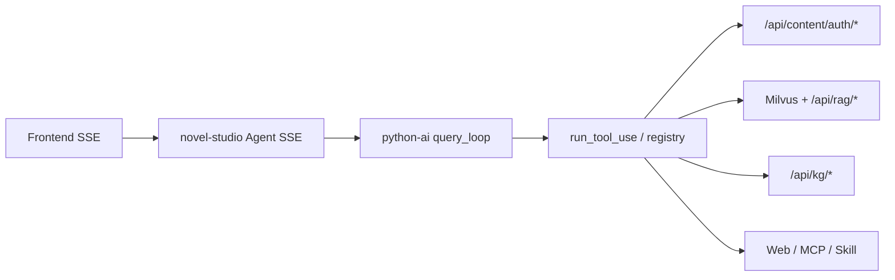

# Agent 工具全览

> 权威注册表：`python-ai/app/agent/tools/registry.py`  
> 前端展示：`frontend/src/utils/agentLabels.ts`、`ccToolDisplay.ts`、`toolIcons.tsx`  
> SSE 载荷：`python-ai/app/agent/harness/events.py`、`tool_ui.py`

本文档覆盖 **Python 工具定义**、**下游 HTTP API**、**SSE 调用/完成展示**、**前端时间线/UI**。

已知问题与重构方向见 **[AGENT_TOOLS_REFACTOR_ISSUES.md](./AGENT_TOOLS_REFACTOR_ISSUES.md)**（诊断稿，不含实现）。  
API/工具/上下文/RAG 合理性深度分析见 **[AGENT_API_TOOLS_CONTEXT_ANALYSIS.md](./AGENT_API_TOOLS_CONTEXT_ANALYSIS.md)**。

---

## 1. 架构速览



### 1.1 双通道结果

| 通道 | 路径 | 用途 |
|------|------|------|
| **模型正文** | `ToolCallResult.content` → `step.completed` → `ToolMessage` | LLM 下一轮规划 |
| **UI 摘要** | `tool.completed.display_excerpt` / `output_summary` | 编排时间线、右侧工具行 |

UI 摘要由 `tool_ui.default_ui_excerpt_registry()` + `events.build_tool_completed_sse_payload()` 生成；**不得**把整段正文塞进 `display_excerpt`（WriteChapter 流式正文走 `chapter.stream.delta`）。

### 1.2 SSE 事件（工具一步）

| 阶段 | 事件 | 前端行为 |
|------|------|----------|
| 开始 | `step.started` | 内部步序（部分工具不单独展示） |
| 开始 | `tool.started` | `CcToolRow` 标题 + 图标动画（`ToolIcon`） |
| 进行中 | `tool.progress` | 进度文案 / `display_excerpt` 流式追加 |
| 流式写章 | `chapter.stream.started` / `delta` / `completed` | 编辑器正文实时更新 + 时间线 |
| 等待用户 | `run.waiting` | AskUser 交互卡片 |
| 完成 | `tool.completed` | 工具行 phase→已完成；展示 `output_summary` |
| 完成 | `step.completed` | 编排层状态更新 |
| 失败 | `step.failed` / `tool.completed{failed:true}` | 红色失败态；静默重试时可能隐藏中间失败 |

### 1.3 隐藏 / 内部工具（不在编排时间线展示）

定义：`frontend/src/utils/agentOrchestration.ts`（与 Python `cc_visibility.HIDDEN_UI_TOOLS` 对齐）

| 名称 | 说明 |
|------|------|
| `output` | 助手最终自然语言回复（走 `message.delta` 进聊天气泡） |
| `PlanResult` / `StepResult` | Structured output 强制工具（编排轮 JSON） |
| `Brief` / `end` | 内部终态 |
| `TodoWrite` | 时间线隐藏，但 `tool.completed` 仍驱动左下待办面板 |
| `orchestrator` / `plan` / `write_chapter` | 历史回放兼容 |

### 1.4 Content API 约定

Python 工具经 `CONTENT_BASE_URL`（默认 `http://127.0.0.1:8080`）访问 novel-studio：

- 前缀：`/api/content/auth`
- 请求头：`X-User-Id`、`X-Internal-Service-Key`；写章/记忆可选 `X-Edit-Source: ai`
- 响应：Java `Result { code, data, success }`，Python 用 `unwrap_result()` 解包
- **章节行（2026）**：服务端在 `ChapterSummaryDTO.listIndex` / `ChapterRowDTO.index` 下发 1-based 阅读序；Python `chapter_catalog` 优先走下列端点，旧端点仍兼容

| 端点 | 作用 |
|------|------|
| `GET …/novels/{novelId}/chapters` | 章摘要列表（含 `listIndex`） |
| `GET …/novels/{novelId}/chapters/rows` | Agent 章行视图（`index` + `chapterId` + 元数据） |
| `GET …/novels/{novelId}/chapters/resolve?chapterId=&title=&index=` | 按三选一解析单行 |
| `GET …/novels/{novelId}/chapters/read?chapterId=&title=&index=&offset=&limit=` | 按目标读切片（含 `listIndex`） |
| `GET …/chapters/{chapterId}/read` | 按 ID 读切片（legacy） |

---

## 2. 章节工具（7）

实现：`python-ai/app/agent/tools/chapter.py` → `chapter_client` → `chapter_store.py`

### 2.1 ListChapters

| 项 | 内容 |
|----|------|
| **输入** | `include_summary?: bool` |
| **API** | `GET …/chapters/rows` 或 `GET …/chapters`（均含服务端 `listIndex`） |
| **模型结果** | JSON：`count`、`chapters[]`（index/id/title/word_count）、可选 `duplicate_titles` |
| **context_patch** | `chapters`、`last_chapter_list`（Markdown 目录文本） |
| **调用中** | `tool.progress`：「列举章节…」 |
| **完成后 UI** | 标题「列举章节」；摘要如「N 条章节路径」；图标 `Glob` |
| **只读** | 是；可并发 |

### 2.2 ChapterAudit

| 项 | 内容 |
|----|------|
| **输入** | 无字段 |
| **API** | 无（基于 `ListChapters` 缓存/catalog 本地审计） |
| **模型结果** | JSON 报告：重复标题、空章、标题含「第N章」前缀等 |
| **context_patch** | `last_chapter_audit`、`chapters` |
| **调用中** | 普通 `tool.started` |
| **完成后 UI** | 显示名 **ChapterAudit**（前端 i18n 待补，可能显示英文名）；默认摘要为首行 JSON |
| **只读** | 是；审查子 Agent 可用 |

### 2.3 ReadChapter

| 项 | 内容 |
|----|------|
| **输入** | `index` / `chapter_id` / `title`（三选一）；`offset`/`limit` 可选（1-based 行号分页） |
| **API** | 优先 `GET …/novels/{novelId}/chapters/read?index|chapterId|title=&offset=&limit=`；fallback `GET …/chapters/{chapterId}/read` |
| **模型结果** | 带行号正文（`     1\t...` 格式） |
| **context_patch** | `chapters`（刷新章节目录行） |
| **调用中** | `tool.progress` + 可选 `display_excerpt` 流式预览 |
| **完成后 UI** | 「阅读章节」；`result_labels` 章节名；摘要「已读取 N 行」；图标 `Read`；连续多次阅读可折叠 |
| **只读** | 是 |

### 2.4 WriteChapter

| 项 | 内容 |
|----|------|
| **输入** | `title`（纯文本，无「第N章」）；`content`（空则流式生成）；`chapter_id`；`position` / `after_chapter_id` / `before_chapter_id` |
| **API** | `POST /api/content/auth/novels/{novelId}/chapters` 或 `PUT /api/content/auth/chapters/{chapterId}` |
| **流式** | `content` 为空 → `should_stream_chapter_write` → LLM 流式 + `StreamingChapterAppender` 后台持久化 |
| **SSE 流** | `chapter.stream.started` → `chapter.stream.delta`（编辑器）→ `chapter.stream.completed` → `tool.completed` |
| **模型结果** | 成功 JSON `{ok, chapter_id, index, title}` 或流式中间态 |
| **context_patch** | `chapter_write`、`chapters`（更新目录） |
| **调用中** | 「写入章节…」「正在生成正文…」 |
| **完成后 UI** | 「写入章节」+ 标题；摘要「已写入《xxx》」；触发 **审查子 Agent**（只读 QA） |
| **副作用** | 异步 RAG 索引（`index_with_retry`）；`KG_ENABLED` 时异步 KG 抽取 |

### 2.5 EditChapter

| 项 | 内容 |
|----|------|
| **输入** | 定位：`index` / `chapter_id` / `title`；`mode=rewrite|patch`；patch 用 `old_string`/`new_string`；rewrite 服务端流式生成正文 |
| **API** | `GET` 读全文 + `PUT` 写回（同 WriteChapter） |
| **流式** | 无 preset `content/new_string` 且能定位章节 → 流式生成正文，完成后 **`old_string=""` 整章保存**（避免 old_string 匹配失败） |
| **匹配** | `text_edit.apply_string_replace`：容忍 ReadChapter 行号、空白、全角空格；大段改写可 fallback 整章替换 |
| **静默重试** | `old_string not found` 最多 3 次（UI 隐藏中间失败，LLM 修参数） |
| **调用中** | 同 WriteChapter 流式事件 |
| **完成后 UI** | 「编辑章节」；摘要「已更新《xxx》」；图标 `Edit` |

### 2.6 DeleteChapter

| 项 | 内容 |
|----|------|
| **输入** | `chapter_id` / `chapter_ids` / `title` / `index` / `dedupe_title` |
| **API** | `DELETE /api/content/auth/chapters/{chapterId}` |
| **模型结果** | JSON 删除列表 |
| **context_patch** | `chapters` |
| **完成后 UI** | 「删除章节」；摘要「已删除 …」；图标 `Delete` |
| **破坏性** | 是 |

### 2.7 ReorderChapters

| 项 | 内容 |
|----|------|
| **输入** | `chapter_ids`（全序）或 `moves[{chapter_id, position}]` |
| **API** | `POST /api/content/auth/novels/{novelId}/chapters/reorder` body `{ids:[]}` |
| **模型结果** | JSON 新顺序 |
| **context_patch** | `chapters` |
| **完成后 UI** | 「调整章节顺序」；摘要「已调整 N 个章节顺序」 |
| **触发审查** | 是 |

---

## 3. 叙事审查（1）

### 3.1 NarrativeReview

| 项 | 内容 |
|----|------|
| **实现** | `python-ai/app/agent/tools/narrative_review.py` |
| **输入** | `scope`: recent / full_book / changed；`focus_chapter_ids`；`max_chapters`；各项 check_* 开关 |
| **API** | 间接：`ReadChapter`、`ReadMemory`、embedding 语义查重（Milvus） |
| **模型结果** | 结构化 JSON 报告（重复、连贯性、大纲偏离等） |
| **context_patch** | `last_narrative_review`、`narrative_review_chapter_ids` |
| **调用中** | 普通工具步（可能较慢，多轮子工具） |
| **完成后 UI** | 显示名 **NarrativeReview**（i18n 待补）；JSON 摘要 |
| **只读** | 是；审查子 Agent 核心工具 |

---

## 4. 创作记忆工具（6）

实现：`python-ai/app/agent/tools/memory.py` → `memory_client` → `memory_store.py` / `story_memory_content.py`

**Scope 枚举**：`novel` | `world` | `character` | `chapter` | `background`

**API 基路径**（有 `novel_id` 时优先小说级）：

| 操作 | 路径 |
|------|------|
| 读树 | `GET /api/content/auth/novels/{novelId}/story-memory` |
| 分页读 | `GET .../story-memory/read?scope=&key=&item_id=&offset=&limit=` |
| 补丁写 | `POST .../story-memory/patch` |
| 删条目 | `POST .../story-memory/delete` |
| 清空 scope | `POST .../story-memory/clear` |

无 `novel_id` 时回退 ` /api/content/auth/sessions/{sessionId}/story-memory/*`。

### 4.1 ListMemory

| 项 | 内容 |
|----|------|
| **输入** | `scope?` |
| **API** | 本地 `get_story_memory()` 解析树（可经 Content 拉取） |
| **完成后 UI** | 「列举记忆」；摘要条目数；图标 `Glob` |

### 4.2 ReadMemory

| 项 | 内容 |
|----|------|
| **输入** | `scope`、`key`；`item_id?`；`offset`/`limit?` |
| **API** | `GET .../story-memory/read` |
| **完成后 UI** | 「查阅记忆」+ scope 标签；`result_labels`；图标 `Read` |

### 4.3 WriteMemory

| 项 | 内容 |
|----|------|
| **输入** | `scope`、`key`、`payload`（v1 JSON）；`item_id?` |
| **API** | `POST .../story-memory/patch` |
| **context_patch** | `last_memory_patch`、`memory_async` |
| **完成后 UI** | 「写入记忆」；图标 `Write` |

### 4.4 EditMemory

| 项 | 内容 |
|----|------|
| **输入** | 同 Edit 语义：`old_string` / `new_string` |
| **API** | 读 + patch |
| **静默重试** | 同 EditChapter（`old_string not found`） |
| **完成后 UI** | 「编辑记忆」；图标 `Edit` |

### 4.5 DeleteMemory

| 项 | 内容 |
|----|------|
| **输入** | `scope`、`key`、`item_id?` |
| **API** | `POST .../story-memory/delete` |
| **完成后 UI** | 「删除记忆」；图标 `Delete` |

### 4.6 ClearMemory

| 项 | 内容 |
|----|------|
| **输入** | `scope` |
| **API** | `POST .../story-memory/clear` |
| **完成后 UI** | 「删除记忆」（与 Delete 共用 delete 图标样式） |

---

## 5. 知识检索（2）

实现：`python-ai/app/agent/tools/knowledge.py`

依赖：`KG_ENABLED`、`MILVUS_HOST`、`RAG_EMBED_API_KEY`（embedding 可与 LLM 同源）

### 5.1 SearchKnowledge

| 项 | 内容 |
|----|------|
| **输入** | `query`；`mode`: vector / graph / hybrid；`top_k` |
| **API** | 向量：`search_novel()` → Milvus collection `novel_chapters`；graph：`character_graph()` |
| **Python RAG** | `POST /api/rag/search`（内部）；索引 `POST /api/rag/index/chapter` |
| **Java 重建索引** | `POST /api/content/auth/novels/{novelId}/reindex` → Worker 调 python-ai |
| **完成后 UI** | 「知识检索」；摘要「找到 N 处匹配」；图标 `Grep` |
| **只读** | 是 |

### 5.2 GetCharacterGraph

| 项 | 内容 |
|----|------|
| **输入** | `character` 角色名 |
| **API** | Python `GET /api/kg/novels/{novelId}/graph`（内存图）；前端侧栏另走 Java `GET .../knowledge-graph` |
| **KG 未启用** | 返回空图 + note |
| **完成后 UI** | 「角色关系图」；图标 `Grep` |

---

## 6. 交互与子 Agent（3）

实现：`python-ai/app/agent/tools/interaction.py`

### 6.1 AskUser

| 项 | 内容 |
|----|------|
| **输入** | `questions[]`、`options?` |
| **API** | 无 |
| **行为** | `action=wait` → SSE `run.waiting` + `interaction` payload |
| **时间线** | 专用交互块（非普通 CcToolRow 折叠） |
| **完成后 UI** | 「询问」；「等待你的回复…」；图标 `AskUser` |

### 6.2 TodoWrite

| 项 | 内容 |
|----|------|
| **输入** | `todos[{id, content, status}]`、`merge` |
| **API** | 无（`context_patch.todos`） |
| **时间线** | **隐藏**；`tool.completed` 带 `todos` → 左下 `TimelineTodoList` |
| **UI 摘要** | 空（刻意不刷屏） |

### 6.3 Agent

| 项 | 内容 |
|----|------|
| **输入** | `description`（UI 标题）、`prompt`（子任务全文） |
| **API** | 无（进程内 `run_subagent`） |
| **限制** | 子 Agent 禁止 `Agent` 嵌套；排除 `SUBAGENT_EXCLUDED_TOOLS` |
| **调用中** | 嵌套 `OrchestrationLayer` + 子时间线 |
| **完成后 UI** | 「子任务：{description}」；图标 `Agent` |
| **触发审查** | 批量写章后可触发只读审查子 Agent |

**审查子 Agent 允许工具**：`ListChapters`、`ReadChapter`、`ListMemory`、`ReadMemory`、`ChapterAudit`、`NarrativeReview`、`SearchKnowledge`、`GetCharacterGraph`（见 `review_agent.py`）。

---

## 7. 网页工具（2）

实现：`python-ai/app/agent/tools/web.py`

### 7.1 WebSearch

| 项 | 内容 |
|----|------|
| **启用** | `WEB_SEARCH_API_KEY`（Tavily） |
| **外部 API** | `POST https://api.tavily.com/search` |
| **完成后 UI** | 「网页搜索」；图标 `WebSearch` |

### 7.2 WebFetch

| 项 | 内容 |
|----|------|
| **输入** | `url`、`prompt?` |
| **外部 API** | HTTP GET，正文截断 12000 字符 |
| **完成后 UI** | 「抓取网页」；图标 `WebFetch` |

---

## 8. MCP（2）

实现：`python-ai/app/agent/tools/mcp.py`  
**启用**：`MCP_SERVERS` 环境变量（当前 List 返回空；Read 未接线）

| 工具 | 输入 | 状态 |
|------|------|------|
| ListMcpResources | `server?` | 占位 |
| ReadMcpResource | `server`、`uri` | 未实现 |

---

## 9. Skill（1）

实现：`python-ai/app/agent/tools/skill.py`  
**启用**：`AGENT_SKILLS_DIR` 指向含 `{name}.md` 或 `{name}/SKILL.md` 的目录

| 项 | 内容 |
|----|------|
| **输入** | `skill` 名称 |
| **行为** | 读文件 → `context_patch.skill_prompt` |
| **完成后 UI** | 「已调用技能：{name}」；图标 `Skill` |

---

## 10. 前端展示索引

> 重构问题与优先级见 [`AGENT_TOOLS_REFACTOR_ISSUES.md`](./AGENT_TOOLS_REFACTOR_ISSUES.md)。  
> **目标 UI 规范**见下文 **§10.4**（实现前以文档为准）。

### 10.1 文件职责（现状）

| 文件 | 职责 |
|------|------|
| `frontend/src/utils/agentLabels.ts` | 工具中文名 `toolDisplayName()` |
| `frontend/src/utils/agentToolNames.ts` | 旧名 → CC 别名；章节/记忆启发式 |
| `frontend/src/utils/ccToolDisplay.ts` | 时间线标题、副标题、折叠阅读 |
| `frontend/src/utils/toolDetailFormat.ts` | 输入/输出格式化（**待收敛至 §10.4**） |
| `frontend/src/utils/toolIcons.tsx` | SVG 图标映射 |
| `frontend/src/utils/agentToolStats.ts` | Run 结束统计「阅读 N 章 · 写入 M 章…」 |
| `frontend/src/utils/agentOrchestration.ts` | 隐藏工具、编排 i18n |
| `frontend/src/components/agent/timeline/CcToolRow.tsx` | 单行工具 UI（**待替换为 ToolStepView**） |
| `frontend/src/components/agent/timeline/OrchestrationLayer.tsx` | 编排块 + 完成统计 |
| `frontend/src/hooks/editor/useEditorAgentStream.ts` | SSE 消费、`chapter.stream.delta` → 编辑器 |

**目标新增**（§10.4）：

| 文件 | 职责 |
|------|------|
| `frontend/src/utils/toolUiFormatters.ts` | 每工具 `formatInputForUi` / `formatOutputForUi` 注册表 |
| `frontend/src/utils/toolTitleI18n.ts` | `resolveToolTitle(tool, phase)` — 按阶段取 i18n 标题 |
| `frontend/src/i18n/locales/{zh,en}/editor.json` | `toolTitles.{ToolName}.{phase}` 文案 |
| `frontend/src/components/agent/timeline/ToolStepView.tsx` | 统一单行工具行（图标 + **阶段标题** + 结果） |

### 10.2 工具名 → 显示名 → 图标

| API 工具名 | 中文（editor i18n） | 图标基类 |
|------------|---------------------|----------|
| ListChapters | 列举章节 | Glob |
| ChapterAudit | （待 i18n） | 默认扳手 |
| ReadChapter | 阅读章节 | Read |
| WriteChapter | 写入章节 | Write |
| EditChapter | 编辑章节 | Edit |
| DeleteChapter | 删除章节 | Delete |
| ReorderChapters | 调整章节顺序 | 默认 |
| NarrativeReview | （待 i18n） | 默认 |
| ListMemory | 列举记忆 | Glob |
| ReadMemory | 查阅记忆 | Read |
| WriteMemory | 写入记忆 | Write |
| EditMemory | 编辑记忆 | Edit |
| DeleteMemory | 删除记忆 | Delete |
| ClearMemory | 删除记忆 | Delete |
| SearchKnowledge | 知识检索 | Grep |
| GetCharacterGraph | 角色关系图 | Grep |
| AskUser | 询问 | AskUser |
| TodoWrite | 任务（时间线隐藏） | TodoWrite |
| Agent | 子任务 | Agent |
| WebSearch | 网页搜索 | WebSearch |
| WebFetch | 抓取网页 | WebFetch |
| ListMcpResources | MCP 资源 | ListMcpResources |
| ReadMcpResource | 读取 MCP | ReadMcpResource |
| Skill | 技能 | Skill |

### 10.3 遗留 wire 名（回放兼容）

| 遗留名 | 映射工具 |
|--------|----------|
| `chapter_list` / `chapter_read` / `chapter_create` / `chapter_update` / `chapter_delete` | List/Read/Write/Edit/Delete Chapter |
| `memory_read` / `memory_create` / … | Read/Write/Edit/Delete Memory |
| `choose` / `ask_user` | AskUser |
| `context_search` | SearchKnowledge |

### 10.4 目标时间线 UI 规范（单行精简）

编排时间线中每个**可见工具步**采用统一单行结构，信息密度高、无原始 JSON、无重复段落。

#### 10.4.1 布局

标题行主文案**随工具生命周期变化**（开始 → 运行中 → 结束），**不是**全程固定「工具中文名 + phase 后缀」。

```
┌────────────────────────────────────────────────────────────────────────┐
│ [图标]  {阶段标题} · {输入摘要?}              {结果摘要?}              │
│         ↑ started/running/done/failed 各不相同                          │
│         ↑ running 时整段标题 ShimmerScanText                             │
│         ↑ done/failed 时静态；结果摘要仍在同行右侧                        │
└────────────────────────────────────────────────────────────────────────┘
```

**阶段与标题示例**（`WriteChapter`）：

| 阶段 | SSE / 前端状态 | 标题行主文案（zh） | 扫光 |
|------|----------------|-------------------|------|
| 开始 | `tool.started` / `pending` | 准备写入章节 | 否 |
| 运行中 | `tool.progress` / `running` | 正在写入章节 | **是** |
| 运行中（流式正文） | `chapter.stream.*` | 正在生成正文 | **是** |
| 结束 | `tool.completed` success | 已写入章节 | 否 |
| 结束 | `tool.completed` failed | 写入章节失败 | 否 |

| 区域 | 规则 |
|------|------|
| **图标** | `toolIcons.tsx`；状态色：pending 灰 / running 蓝脉冲 / success 绿 / failed 红。与 `TimelineLeadIcon` 对齐。 |
| **阶段标题** | `resolveToolTitle(tool, phase, ctx)` → i18n `editor:toolTitles.{Tool}.{phase}`；**每工具单独定义**，禁止硬编码中文。 |
| **输入摘要** | 可选，接在标题后 ` · ` + `formatInputForUi`（≤约 48 字）；各阶段均可显示（有 input 即显示）。 |
| **扫光** | `ShimmerScanText` 包裹**整段阶段标题**（仅 `running` / `runningStream`）；结果摘要、输入摘要**不**扫光。 |
| **结果摘要** | `done` / `failed` 时同行展示 `formatOutputForUi`；`started` / `running` 通常为空（流式 Write 除外，见 §10.4.4）。 |
| **展开** | 默认**不展开**。仅当结果摘要被截断且用户点击整行时，才在下方显示完整 formatter 输出（仍禁 JSON）。 |
| **禁止** | 全程固定 `toolDisplayName` 作标题；`JSON.stringify`；`toolInput` 裸对象；模型 `content` 直出。 |

#### 10.4.2 阶段标题 i18n（每工具单独定义）

##### 阶段枚举

```typescript
export type ToolTitlePhase =
  | 'started'        // tool.started，尚未有 progress
  | 'running'        // tool.progress 或执行中
  | 'runningStream'  // 可选：WriteChapter / EditChapter 流式子阶段
  | 'done'           // tool.completed && !failed
  | 'failed'         // tool.completed && failed 或 step.failed
```

**解析**（`toolTitleI18n.ts`）：

```typescript
export function resolveToolTitle(
  toolName: string,
  phase: ToolTitlePhase,
  ctx?: { t: TFunction; subPhase?: string },
): string {
  const tool = normalizeToolName(toolName)
  const key = `editor:toolTitles.${tool}.${phase}`
  const text = ctx?.t(key, { defaultValue: '' })
  if (text) return text
  // 回退：仅开发期告警，生产应 28 工具全覆盖
  return ctx?.t(`editor:toolTitles._fallback.${phase}`, { tool })
}
```

##### i18n 文件结构

路径：`frontend/src/i18n/locales/zh/editor.json`（`en` 同步）

```json
{
  "toolTitles": {
    "_fallback": {
      "started": "准备{{tool}}",
      "running": "正在{{tool}}",
      "runningStream": "正在处理{{tool}}",
      "done": "已完成{{tool}}",
      "failed": "{{tool}}失败"
    },
    "ReadChapter": {
      "started": "准备阅读章节",
      "running": "正在阅读章节",
      "done": "已阅读章节",
      "failed": "阅读章节失败"
    },
    "WriteChapter": {
      "started": "准备写入章节",
      "running": "正在写入章节",
      "runningStream": "正在生成正文",
      "done": "已写入章节",
      "failed": "写入章节失败"
    }
  }
}
```

**维护约定**：

| 规则 | 说明 |
|------|------|
| Key = API 工具名 | 与 `registry.py` 中 `name` 一致（`ReadChapter`，非 `Read`） |
| 五键齐全 | 除隐藏工具外，`started` / `running` / `done` / `failed` 必填；有流式子阶段则加 `runningStream` |
| 中英同步 | `zh/editor.json` 与 `en/editor.json` 同结构同 key |
| 新增工具 | 先补 `toolTitles` 再上线；禁止依赖 `_fallback` 长期占位 |
| 与 `tools.*` 关系 | 旧键 `editor:tools.阅读章节` 仅作兼容；**时间线标题以 `toolTitles` 为准** |

##### 各工具阶段标题（zh 文案 — 实现时写入 i18n）

###### 章节（7）

| 工具 | started | running | runningStream | done | failed |
|------|---------|---------|---------------|------|--------|
| ListChapters | 准备列举章节 | 正在列举章节 | — | 已列举章节 | 列举章节失败 |
| ChapterAudit | 准备审计目录 | 正在审计章节 | — | 审计完成 | 审计失败 |
| ReadChapter | 准备阅读章节 | 正在阅读章节 | — | 已阅读章节 | 阅读章节失败 |
| WriteChapter | 准备写入章节 | 正在写入章节 | 正在生成正文 | 已写入章节 | 写入章节失败 |
| EditChapter | 准备编辑章节 | 正在编辑章节 | 正在应用修改 | 已更新章节 | 编辑章节失败 |
| DeleteChapter | 准备删除章节 | 正在删除章节 | — | 已删除章节 | 删除章节失败 |
| ReorderChapters | 准备调整顺序 | 正在调整顺序 | — | 已调整顺序 | 调整顺序失败 |

###### 记忆（6）

| 工具 | started | running | done | failed |
|------|---------|---------|------|--------|
| ListMemory | 准备列举记忆 | 正在列举记忆 | 已列举记忆 | 列举记忆失败 |
| ReadMemory | 准备查阅记忆 | 正在查阅记忆 | 已查阅记忆 | 查阅记忆失败 |
| WriteMemory | 准备写入记忆 | 正在写入记忆 | 已写入记忆 | 写入记忆失败 |
| EditMemory | 准备编辑记忆 | 正在编辑记忆 | 已更新记忆 | 编辑记忆失败 |
| DeleteMemory | 准备删除记忆 | 正在删除记忆 | 已删除记忆 | 删除记忆失败 |
| ClearMemory | 准备清空记忆 | 正在清空记忆 | 已清空记忆 | 清空记忆失败 |

###### 知识（2）

| 工具 | started | running | done | failed |
|------|---------|---------|------|--------|
| SearchKnowledge | 准备检索知识 | 正在检索知识 | 检索完成 | 检索失败 |
| GetCharacterGraph | 准备查询关系 | 正在查询关系 | 查询完成 | 查询失败 |

###### 交互与子 Agent（3）

| 工具 | started | running | done | failed | 备注 |
|------|---------|---------|------|--------|------|
| AskUser | 准备询问 | 等待你的回复 | 已收到回复 | 询问失败 | 专用交互块 |
| TodoWrite | — | — | — | — | 时间线隐藏 |
| Agent | 准备子任务 | 子任务运行中 | 子任务完成 | 子任务失败 | 标题可插值 `{{description}}` |

###### 网页 / MCP / Skill / 审查

| 工具 | started | running | done | failed |
|------|---------|---------|------|--------|
| WebSearch | 准备搜索网页 | 正在搜索网页 | 搜索完成 | 搜索失败 |
| WebFetch | 准备抓取网页 | 正在抓取网页 | 抓取完成 | 抓取失败 |
| ListMcpResources | 准备列出资源 | 正在列出资源 | 列出完成 | 列出失败 |
| ReadMcpResource | 准备读取资源 | 正在读取资源 | 读取完成 | 读取失败 |
| Skill | 准备加载技能 | 正在加载技能 | 技能已加载 | 加载技能失败 |
| NarrativeReview | 准备叙事审查 | 正在审查 | 审查完成 | 审查失败 |

**插值**（可选，formatter 传入 `t(key, { description, title, query })`）：

- `Agent.started` → `准备子任务：{{description}}`
- `ReadChapter.running` + input → 标题不变，输入摘要显示 `《{{title}}》`

#### 10.4.3 Formatter 注册表

路径：`frontend/src/utils/toolUiFormatters.ts`

```typescript
export type ToolUiFormatContext = {
  step: AgentStepState
  toolInput?: Record<string, unknown>
  payload?: Record<string, unknown>  // tool.completed payload
  t: TFunction  // i18n
}

export type ToolUiFormatter = {
  /** 标题行后、运行前可见：定位参数一行摘要 */
  formatInputForUi?: (ctx: ToolUiFormatContext) => string | undefined
  /** 完成后标题行右侧/续行：关键结果一行摘要 */
  formatOutputForUi: (ctx: ToolUiFormatContext) => string | undefined
}

export const TOOL_UI_FORMATTERS: Record<string, ToolUiFormatter>
```

**解析顺序**（`ToolStepView` 内）：

1. 由 `step.status` + SSE 推断 `ToolTitlePhase`（流式写章 → `runningStream`）
2. `resolveToolTitle(toolName, phase)` → **阶段标题**（i18n）
3. `formatInputForUi` → 输入摘要（各阶段可选）
4. `phase === 'done' | 'failed'` 时 `formatOutputForUi` → 结果摘要
5. 无 formatter → 结果显 `—`；**标题仍必须有 i18n**，不得回退英文工具名

**与 Python 分工**：

| 层 | 职责 |
|----|------|
| Python `tool_ui` / SSE | `tool.progress` 消息可保留（供日志）；**时间线标题不依赖** Python 字符串，由前端 i18n 统一 |
| Python SSE | 提供 `display_excerpt`、`result_labels` 等 → 仅给 `formatOutputForUi` 作原料 |
| 前端 `toolTitles` | 阶段标题唯一来源 |
| 前端 formatter | 输入/结果摘要；截断、章节名解析 |

#### 10.4.4 状态机（标题 phase 推断）

| 前端条件 | ToolTitlePhase | 标题来源 |
|----------|----------------|----------|
| `tool.started`，尚无 progress | `started` | `toolTitles.*.started` |
| `status === 'running'` 且无 stream | `running` | `toolTitles.*.running` + 扫光 |
| `chapter.stream.started` / `delta` | `runningStream` | `toolTitles.*.runningStream` + 扫光 |
| `tool.completed` && !failed | `done` | `toolTitles.*.done` |
| `failed` / `step.failed` | `failed` | `toolTitles.*.failed` |

**合并调用**：连续 N 次同工具 → 标题用**末次** phase 文案 + 后缀 `×N`；`done`/`failed` 混合时标题用 `failed` 若末次失败。

#### 10.4.5 各工具输入/结果 formatter 约定

以下为 **formatInputForUi** / **formatOutputForUi**（结果摘要，非阶段标题）。阶段标题见 **§10.4.2**。

##### 章节（7）

| 工具 | formatInputForUi | formatOutputForUi |
|------|------------------|-------------------|
| **ListChapters** | `含摘要`（仅当 `include_summary=true`） | `共 N 章`；若有 `duplicate_titles` → `· M 组重名` |
| **ChapterAudit** | — | `发现 N 项问题` 或 `目录正常`；禁 JSON 报告 |
| **ReadChapter** | `《章节标题》` 或短 id；有 `offset/limit` → `第 a–b 行` | `已读 N 行` 或 `《标题》`（优先 `result_labels`） |
| **WriteChapter** | `《标题》`；有 `position/after/before` → `插入至…` | `《标题》`；禁重复阶段文案 |
| **EditChapter** | `《标题》` 或短码；有 `old_string` → `替换「…」`（≤20 字） | `《标题》` 或 `已重命名/已移动` |
| **DeleteChapter** | `《标题》` 或定位字段 | `《标题》` |
| **ReorderChapters** | `调整 N 章顺序` | `共 N 章` |

##### 记忆（6）

| 工具 | formatInputForUi | formatOutputForUi |
|------|------------------|-------------------|
| **ListMemory** | `scope` → 中文（角色库/世界观…） | `共 N 条记忆` |
| **ReadMemory** | `scope · key` | `《条目标题》` 或 key |
| **WriteMemory** | `scope · key` | `《标题》` |
| **EditMemory** | `scope · key`；有替换 → `替换「…」` | `《标题》` |
| **DeleteMemory** | `scope · key` 或 `item_id` 短码 | 条目标题 |
| **ClearMemory** | `scope`（必填） | scope 中文名 |

##### 知识（2）

| 工具 | formatInputForUi | formatOutputForUi |
|------|------------------|-------------------|
| **SearchKnowledge** | `「query」`；`top_k` 非默认时附带 | `找到 N 处匹配` 或 `无匹配` |
| **GetCharacterGraph** | `角色：{character}` | `N 个关系` 或 `图谱未启用` / `无关系` |

##### 交互与子 Agent（3）

| 工具 | formatInputForUi | formatOutputForUi | 备注 |
|------|------------------|-------------------|------|
| **AskUser** | 首个问题 ≤40 字 | 问题摘要或「已回复」 | 专用交互块 |
| **TodoWrite** | — | — | 时间线隐藏 |
| **Agent** | `{{description}}` | 子步统计可选 | 阶段标题可插值 description |

##### 网页 / MCP / Skill / 审查

| 工具 | formatInputForUi | formatOutputForUi |
|------|------------------|-------------------|
| **WebSearch** | `「query」` | `N 条结果` |
| **WebFetch** | 域名或短 URL | 失败时原因 |
| **ListMcpResources** | `server`（可选） | `N 个资源` |
| **ReadMcpResource** | `server · uri 末段` | — |
| **Skill** | `{skill}` 名 | — |
| **NarrativeReview** | `审查范围`（若有） | `N 项建议` 或 `通过`；禁 JSON |

#### 10.4.6 组件 `ToolStepView`（目标）

替换 `TimelineToolBlock` 中普通工具分支 + 精简 `CcToolRow`：

```tsx
// 伪代码 — 实现时对齐 timelineClasses
const phase = inferToolTitlePhase(step) // started | running | runningStream | done | failed
const title = resolveToolTitle(step.toolName, phase, { t })
const inputSummary = formatInputForUi(...)
const resultSummary = phase === 'done' || phase === 'failed'
  ? formatOutputForUi(...)
  : undefined
const shimmer = phase === 'running' || phase === 'runningStream'

<div className={TOOL_HEADLINE_ROW}>
  <TimelineLeadIcon iconName={icon} status={visualStatus} />
  <div className={TOOL_TITLE_ROW}>
    {shimmer ? (
      <ShimmerScanText active className={CC_TOOL_NAME}>{title}</ShimmerScanText>
    ) : (
      <span className={CC_TOOL_NAME}>{title}</span>
    )}
    {inputSummary ? <span className={CC_TOOL_ARGS}> · {inputSummary}</span> : null}
    {resultSummary ? (
      <span className={phase === 'failed' ? CC_TOOL_RESULT_FAIL : CC_TOOL_RESULT}>
        {' · '}{resultSummary}
      </span>
    ) : null}
  </div>
</div>
```

- **WriteChapter 流式**：编辑器走 `chapter.stream.delta`；时间线结果区仅显示 phase + 最终 `formatOutputForUi`，**不**在时间线重复流式正文。
- **ReadChapter 连续多次**：可合并为一行 `阅读章节 ×3 · 已读《A》《B》…`（统计逻辑复用 `agentToolStats` 规则）。
- **失败**：`resultSummary` 用红色样式；展示 `formatOutputForUi` 解析后的 `payload.error` 或 `display_excerpt`，剥 XML 标签。

#### 10.4.7 SSE 字段消费（目标）

| 字段 | 用途 |
|------|------|
| `tool` / `step_kind` | formatter lookup |
| `toolInput`（前端 state） | `formatInputForUi` |
| `display_excerpt` | formatter 原料，**不直出** |
| `result_labels` | 章节/记忆标题优先来源 |
| `output_summary` | 仅当 formatter 未注册时的**次选**（逐步废弃） |
| `output` | **禁止**用于时间线展示（仅 Glob/Grep 遗留回放可经 formatter 转树形） |
| `tool.progress` message | **不**直接作标题（仅辅助推断 running）；标题走 `toolTitles` i18n |
| `failed` / `error` | `formatOutputForUi` 错误分支 |

#### 10.4.8 实现检查清单

- [ ] `editor.json` 增加 `toolTitles`，28 工具 × 4 阶段（+ 流式 `runningStream`）中英文
- [ ] 新增 `toolTitleI18n.ts`：`resolveToolTitle` + `inferToolTitlePhase`
- [ ] 新增 `toolUiFormatters.ts`，输入/结果摘要全覆盖
- [ ] `ToolStepView`：阶段标题 + 扫光；废弃 `translateToolDisplayName` 作时间线主标题
- [ ] `ToolStepView` 替换 `CcToolRow` 默认分支；`AskUser` / `Agent` 保留专用布局
- [ ] 删除 `toolDetailFormat.ts` 中 `JSON.stringify` fallback
- [ ] `agentStreamState.ts` 停止重复写 `displayExcerpt` + `toolOutputDetail` + `outputSummary`
- [ ] Playwright：断言 running 时为「正在…」、done 时为「已…」，非固定工具名

---

## 11. 环境变量速查

| 变量 | 影响工具 |
|------|----------|
| `CONTENT_BASE_URL` | 全部章节/记忆 Content API |
| `INTERNAL_SERVICE_KEY` | Content 鉴权 |
| `KG_ENABLED` | SearchKnowledge(graph)、GetCharacterGraph、侧栏 KG |
| `MILVUS_HOST` / `MILVUS_PORT` | SearchKnowledge 向量检索 |
| `RAG_EMBED_*` | 向量 embedding |
| `WEB_SEARCH_API_KEY` | WebSearch |
| `MCP_SERVERS` | MCP 工具注册 |
| `AGENT_SKILLS_DIR` | Skill |

---

## 12. 维护说明

1. **新增工具**：… → 补 `toolTitles.{Tool}.*`（§10.4.2）+ `toolUiFormatters`（§10.4.5）→ 更新本文档。
2. **新增 Content API**：改 `chapter_store` / `story_memory_content`，并在工具章节补 API 表。
3. **i18n**：时间线阶段标题统一 `editor:toolTitles.*`；旧 `editor:tools.*` 仅兼容。
4. **前端展示变更**：以 **§10.4** 为目标规范；现状问题见 `AGENT_TOOLS_REFACTOR_ISSUES.md` §二。

---

*文档版本：2026-06-17，对齐 novel-studio 单体 + python-ai 扁平工具注册表。*
