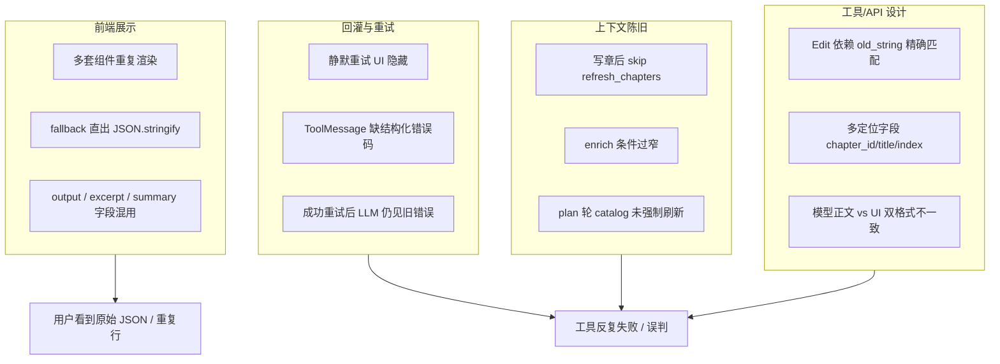

# Agent 工具重构 — 问题整理（诊断稿）

> 本文仅整理现状问题与重构方向，**不含代码改动**。  
> 工具清单见 `[AGENT_TOOLS.md](./AGENT_TOOLS.md)`。

---

## 总览：失败率高的四条主因

---

## 一、错误回灌不清晰 → LLM 误判 → 反复调用失败

### 1.1 现象

- 同一工具（尤其 `EditChapter` / `EditMemory`）在时间线上**失败多次**，或 UI 只显示一次失败但模型已重试多轮。
- LLM 在收到错误后**换错误参数再试**（如乱改 `chapter_id`、重复 `old_string`），而非先 `ReadChapter` / `ListChapters`。
- 用户感觉「Agent 在原地打转」。

### 1.2 根因（代码行为）

| 机制                     | 位置                                                                                | 问题                                                                                                     |
| ---------------------- | --------------------------------------------------------------------------------- | ------------------------------------------------------------------------------------------------------ |
| **静默重试**               | `loop_support.stream_tool_step` + `tool_execution.filter_tool_step_events_for_ui` | 最多 3 次 in-batch 重试；**中间失败 SSE 对前端隐藏**，但每轮失败都会写一条 `ToolMessage` 进对话（若最终仍失败则 LLM 已累积多条错误）。               |
| **成功重试后的 ToolMessage** | 同上                                                                                | 若第 2/3 次成功，UI 可能只看到成功，但 **messages 里可能仍保留第 1 次失败的 ToolMessage**（需确认 transcript 是否去重；当前易造成模型上下文污染）。     |
| **错误格式不统一**            | 各工具 `chapter.py` / `memory.py`                                                    | 多为 `<tool_use_error>英文短句</tool_use_error>`，**无 error_code、无建议下一步工具**（如「请先 ListChapters 取 chapter_id」）。 |
| **recoverable 判定**     | `classify_tool_step_failure` + `is_recoverable_tool_execution_failure`            | `old_string not found` 标为 `tool_validation` 可 recover，但回灌给 LLM 的仍是裸字符串，**未区分「可静默修参」vs「必须重读正文」**。       |
| **LLM 修参**             | `tool_input_repair.py`                                                            | 失败时用 LLM 修 JSON；修失败则 `_tool_retry` 塞进 input，**模型未必理解 `_tool_retry` 语义**（非 schema 字段）。                  |
| **整轮 recover 上限**      | `loop.py` `_MAX_TOOL_RECOVERIES_PER_TURN`                                         | 一轮 plan 内多次 recover 后 **直接 terminal**，用户只见「编排完成/失败」但不知中间经历了几次。                                         |

### 1.3 与「回灌未标明」直接相关的缺口

1. **ToolMessage 缺少结构化头**：理想应类似 `error_code=OLD_STRING_NOT_FOUND suggested_next=ReadChapter chapter_id=xxx`，现状只有自然语言/英文片段。
2. **静默重试与 transcript 不一致**：UI 隐藏失败 ≠ 模型上下文隐藏失败。
3. **成功路径未显式告知「第 N 次重试已成功」**，模型可能仍按失败态规划。
4. `**tool_result_routing` 注释**要求 UI 不用 `output_summary` 喂模型，但 **失败时** `display.content` 与 `tool.completed.output` 仍可能混用，模型看到的错误形态不唯一。

### 1.4 重构方向（建议，未实施）

- 统一 **ToolError 协议**：`code` + `message` + `hint` + `suggested_tools[]` + `affected_resource`（chapter_id/key）。
- 静默重试：**要么** transcript 也只保留最终一次 ToolMessage，**要么** 在成功 ToolMessage 前插入一条 System 说明「前 2 次尝试已废弃」。
- 对 `old_string not found`：**强制** hint 带 `ReadChapter(chapter_id)` 而非仅 LLM repair。
- 前端对失败工具展示 **attempt 次数**（与静默重试对齐），避免用户以为只失败一次。

---

## 二、前端工具状态展示 — 重复元素与原始 JSON

> **目标 UI 规范**（单行精简布局、`formatInputForUi` / `formatOutputForUi`、扫光仅标题行）见 [`AGENT_TOOLS.md` §10.4](./AGENT_TOOLS.md#104-目标时间线-ui-规范单行精简)。

### 2.1 现象

- 编排时间线同一工具：**标题行 + 副标题 + outputSummary + displayExcerpt + toolOutputDetail + 展开区** 内容重复。
- 部分工具展开后看到 `**{"ok":true,"chapter_id":"..."}`** 或整段 `JSON.stringify(toolInput)`。
- `ListChapters` / `SearchKnowledge` 等结果偶发 **inventory 头 + excerpt + output 三段类似列表**。
- CC 别名（Read/Write/Glob）与 API 名（ReadChapter）**混用**，同一逻辑在 `ccToolDisplay`、`agentLabels`、`agentToolNames` 三处维护。

### 2.2 根因（代码路径）

| 层级          | 文件                                                     | 问题                                                                                                            |
| ----------- | ------------------------------------------------------ | ------------------------------------------------------------------------------------------------------------- |
| SSE 归一      | `agentStreamState.ts`                                  | `tool.completed` / `tool.progress` 同时写 `displayExcerpt`、`toolOutputDetail`、`outputSummary`、`detail`，**字段冗余**。 |
| 展示优先级       | `toolDetailFormat.ts`                                  | `formatToolInputFromPayload` 在无法解析时 `**JSON.stringify(raw, null, 2)` 直出**（L64–71）。                            |
| 输出 fallback | `toolOutputFromPayload`                                | 无 excerpt 时 fallback 到 `payload.output`（模型正文，常为 JSON）。                                                        |
| 组件层         | `TimelineToolBlock.tsx`                                | 单文件内 **3 处 `CcToolRow` 分支**（AskUser / Agent / 默认），read/write/merge 逻辑重叠。                                      |
| 重复渲染        | `CcToolRow` + `ToolDetailPeek` + `readToolBodyExcerpt` | 标题下 hint、branch 内 excerpt、peek 内 output **可能三段相似文本**。                                                         |
| 错误展示        | `containsToolUseError` + `FAIL_TAG`                    | 失败时仍可能展示 `<tool_use_error>` 内 raw 英文。                                                                         |
| i18n 缺口     | `agentLabels.ts`                                       | `ChapterAudit`、`NarrativeReview` 等 **无中文映射**，直接显示 API 名或 JSON key。                                            |

### 2.3 「原始 JSON」典型来源

1. 工具成功返回 `**ToolCallResult.content` 为 JSON 字符串**（ListChapters、WriteChapter ok、SearchKnowledge hits），而 `build_tool_completed_sse_payload` 未生成 human excerpt → 前端 fallback 到 output。
2. `**toolInput` 展示**：domain 工具输入本是结构化对象，未映射字段时走 JSON.stringify。
3. **Glob/Grep 遗留路径**：inventory 头 `# 章节（` 与 `formatGlobGrepDisplayOutput` 与 excerpt 叠加。

### 2.4 重构方向（目标 UI — 见 AGENT_TOOLS §10.4）

- **阶段标题 i18n**：`started` → `running` → `done`/`failed` 主文案各不相同（`editor:toolTitles.{Tool}.{phase}`），**非**固定工具名 + phase 后缀。
- **单行布局**：`[图标] [阶段标题（运行中扫光）] · [输入摘要?] · [结果摘要?]`。
- **专用 formatter**：`formatInputForUi` / `formatOutputForUi`；禁 JSON fallback。
- **扫光**：仅包裹 `running` / `runningStream` 的**阶段标题**。
- **SSE**：标题不依赖 Python `tool.progress` 字符串；由前端 i18n 统一。
- **组件**：`ToolStepView` + `toolTitleI18n.ts` + `toolUiFormatters.ts`。

---

## 三、上下文更新滞后 → 参数不准 → 工具失败

### 3.1 现象

- 刚 `WriteChapter` / 并行 `Agent` 写完，下一轮立刻 `EditChapter` 仍报 **chapter not found** 或 **index 不对**。
- `ListChapters` 在 plan 上下文里仍是 **旧目录**，模型用了过期 `chapter_id`。
- Story Memory 补丁后，`ReadMemory` / `EditMemory` 用的 key 与 UI 不一致。
- 流式写章期间 **append 与 finalize 竞态**，模型以为章节已完整可编辑。

### 3.2 根因（代码行为）

| 机制                       | 位置                                                          | 问题                                                                                                                                                                      |
| ------------------------ | ----------------------------------------------------------- | ----------------------------------------------------------------------------------------------------------------------------------------------------------------------- |
| **写章后 refresh 条件**       | `loop.py` ~891                                              | `refresh_chapters = tool not in _CHAPTER_WRITE_TOOLS and not (patch 含 chapters)` — **WriteChapter/EditChapter 成功时若 patch 已有 chapters 则不再 pull API**，可能仍是 patch 内快照而非最新。 |
| **enrich 默认**            | `enrich_context_for_tool_step(..., refresh_chapters=False)` | 流式 pipeline **刻意不 refresh**（性能），但 plan 下一工具可能依赖新目录。                                                                                                                     |
| **story_memory refresh** | `enrich.py`                                                 | 仅 `refresh_story_memory`、角色任务关键词、或 last_tool 为旧 VFS 名 `Read/Write/Edit` 才刷新；**WriteMemory 后不一定刷新 prompt 内 memory**。                                                     |
| **plan 轮 catalog**       | `plan_context` / RUN_CONTEXT                                | 章节列表注入依赖 `ctx.chapters` 快照；**无「每轮 plan 前强制 fetch」** 开关。                                                                                                                 |
| **context_patch 合并**     | `merge_context`                                             | patch 内 `chapters` 与 API 真值冲突时 **以 patch 为准**。                                                                                                                          |
| **异步持久化**                | `chapter_stream_persist` / MQ                               | 流式 append 与 `EditChapter` finalize **时序**；Edit 流式路径曾部分写入（已部分修复思路：Edit 不 partial persist）。                                                                               |
| **子 Agent**              | `run_subagent`                                              | 子任务改章后 **父 ctx.chapters 更新依赖 patch 回传**，漏传则父 Agent 仍用旧 catalog。                                                                                                         |

### 3.3 与「工具要求精确参数」的耦合

当前工具设计 **强依赖**：

- `chapter_id` UUID（ListChapters 才能得）
- `index` 1-based（随 reorder 变）
- `old_string` 与 ReadChapter 返回 **逐字一致**
- Memory `scope` + `key` + `item_id` 三元组

上下文一旦滞后，**不是 LLM「笨」**，而是 **入参在 API 层必然失败**，触发 1.1 的 retry 螺旋。

### 3.4 重构方向（建议，未实施）

- **Plan 前强制刷新**：每轮 bind_tools 前 `fetch_chapter_summaries` + memory catalog 摘要（可缓存 TTL 1s / version token）。
- **写操作后 invalidate**：任何 chapter/memory mutation → 设置 `ctx.catalog_stale=true`，下一工具 step 必 refresh。
- **RUN_CONTEXT 带 version**：`catalog_version` / `updated_at`，ToolMessage 错误里回显「你用的 id 属于 version N，当前 version M」。
- **削弱 fragile 参数**：Edit 类工具增加 `mode=replace_full` 一阶入口；或用 `chapter_id + patch_ops[]` 替代 old_string。
- **子 Agent 回传契约**：子 run 结束必须 merge `chapters` + `memory_revision` 到父 ctx。

---

## 四、工具与 API 设计不合理 → 固有失败率高

### 4.1 工具层设计问题

| 工具                             | 设计痛点                                                | 典型失败                   |
| ------------------------------ | --------------------------------------------------- | ---------------------- |
| **EditChapter / EditMemory**   | 字符串 replace 语义；Read 带行号 vs 存储无行号                    | `old_string not found` |
| **WriteChapter**               | `content` 空→流式、非空→同步，两路径行为差异大                       | 模型不知道何时会 stream        |
| **DeleteChapter**              | 5 种定位方式互斥逻辑复杂                                       | 删错 / 找不到               |
| **ReorderChapters**            | `chapter_ids` 全序 vs `moves` 部分，与 Edit 的 position 重叠 | 排序失败 + 与 Edit 重复调      |
| **WriteMemory**                | 要求 v1 JSON envelope，模型常输出 markdown                  | InputValidationError   |
| **SearchKnowledge**            | mode vector/graph/hybrid 对模型不透明                     | 空 hits / 错 mode        |
| **GetCharacterGraph vs 侧栏 KG** | 两套入口（工具 vs Java proxy），数据同源但 enabled 语义易混           | 「图谱未启用」                |
| **Agent**                      | 子 Agent 工具集与父 Agent 不同，回传格式不统一                      | 父 Agent 重复劳动           |
| **MCP / Skill**                | 半占位（MCP read 未接线）                                   | 配置后仍报错                 |

### 4.2 API 层设计问题

| 问题             | 说明                                                                                                    |
| -------------- | ----------------------------------------------------------------------------------------------------- |
| **双栈路径**       | Python 工具 → `/api/content/auth/`*；浏览器 → 同路径但带 Sign/AES；**内部 key 路径与浏览器路径字段名不一致**（camelCase vs snake）。 |
| **章节读/写分裂**    | `GET .../read`（行号文本）vs `GET .../{id}`（raw content）vs 工具内 `fetch_chapter_full`，模型看到的格式不统一。             |
| **Memory 双存储** | session 级 vs novel 级 story-memory；工具优先 novel，但 session 未迁移时 **key 对不上**。                              |
| **索引与 KG 异步**  | 写章后 RAG/KG **异步**；SearchKnowledge / 侧栏 KG **立即可查** → 空结果，模型以为失败反复调。                                   |
| **错误 HTTP 映射** | Content API 4xx/5xx 转成 `<tool_use_error>` 字符串，**丢 status / field 级校验信息**。                             |

### 4.3 重构方向（建议，未实施）

**工具面（对 LLM 更友好）**

1. **读写分离更清晰**：Read 只读；Write/Edit 合并为「保存章节（full | patch）」两工具，减少 Edit+old_string。
2. **定位统一**：章节只保留 `chapter_id`（List 必选前置）；title/index 仅作 human hint，不作为 API 参数。
3. **Memory 写**：接受 markdown/plain，服务端转 envelope，不让模型手写 JSON schema。
4. **Search 合一**：默认 hybrid，去掉 model 选的 mode；graph 作为内部增强。
5. **审查工具**：NarrativeReview 输出 **人类可读摘要** 进 UI，JSON 仅给模型。

**API 面（对工具实现更友好）**

1. **Internal tool API 专用路由**：`/api/content/auth/agent/`* 稳定 schema、统一 snake_case、结构化错误体。
2. **Chapter read 单一格式**：要么 always numbered slice，要么 always raw + metadata，工具层不再猜。
3. **Catalog revision**：list chapters 带 `etag`；write 带 `If-Match`，冲突返回 409 + 新 catalog。
4. **Indexing 状态查询**：`GET .../reindex/status` 与 Search 工具联动，未索引时明确 note 而非空 hits。

---

## 五、问题交叉矩阵（优先级参考）

|                               | 失败率影响 | 用户可见度 | 改造量 |
| ----------------------------- | ----- | ----- | --- |
| 错误回灌结构化 + transcript 与静默重试一致  | 高     | 中     | 中   |
| 上下文 plan 前强制刷新 catalog        | 高     | 低     | 中   |
| Edit 工具改语义（弱化 old_string）     | 高     | 中     | 大   |
| 前端 SSE 字段收敛 + 禁 JSON fallback | 中     | 高     | 中   |
| Timeline 组件合并                 | 低     | 高     | 中   |
| API 专用 agent 路由 + 409 catalog | 高     | 低     | 大   |

---

## 六、建议重构阶段（仅规划）

### Phase A — 可观测与契约（低风险）

- 定义 ToolError JSON schema；SSE 增加 `error_code` / `attempt`（仅 UI）。
- 文档化「模型正文 vs UI 摘要」字段（已有 `tool_result_routing.py` 注释，需 enforcement）。
- 前端禁止 `JSON.stringify` 作为用户可见 fallback，改为「无摘要」占位。

### Phase B — 上下文真值（中风险）

- Plan 轮 catalog/memory refresh 策略；`catalog_stale` 标志。
- 子 Agent patch 回传校验。

### Phase C — 工具/API 语义（高风险，需迁移）

- EditChapter → SaveChapterPatch / SaveChapterFull。
- Content API agent 子路由 + 结构化 4xx。
- Memory 写入放宽格式。

### Phase D — 前端统一（中风险）

- 实现 **§10.4**：`toolTitles` 阶段 i18n + `ToolStepView` + `toolUiFormatters.ts`。
- 标题随 started/running/done/failed 变化；扫光仅 running 标题。
- 禁 JSON fallback；`zh`/`en` 同步。

---

## 七、与现有文档关系

| 文档                                   | 用途                          |
| ------------------------------------ | --------------------------- |
| `[AGENT_TOOLS.md](./AGENT_TOOLS.md)` | 现状工具/API/前端 **是什么**；**§10.4 目标 UI 规范** |
| `[AGENT_API_TOOLS_CONTEXT_ANALYSIS.md](./AGENT_API_TOOLS_CONTEXT_ANALYSIS.md)` | API/工具/上下文/RAG **是否合理**；**§八–§十五 异步/重试/并发/安全续排查** |
| `[AGENT_REFACTOR_PLAN.md](./AGENT_REFACTOR_PLAN.md)` | **优化方案与执行计划**（阶段/验收/灰度/回滚） |
| **本文** | 现状 **有什么问题**、为何失败率高、重构应先改什么 |

---

*整理自 2026-06 对话与代码走读；未改生产代码。*