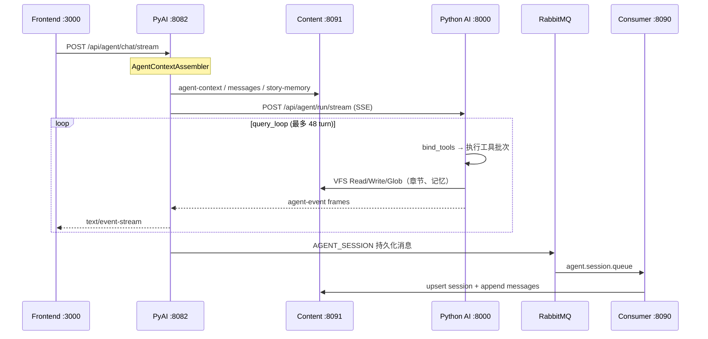

# 写小说 AI Agent — 项目架构文档

> 本文档基于仓库当前代码与部署配置整理，面向新成员 onboarding 与架构评审。  
> 协作规范与重启流程仍以根目录 [`CLAUDE.md`](../CLAUDE.md) 为准。

---

## 1. 项目概述

### 1.1 业务定位

本项目是一套**网文创作 AI 助手**全栈系统：用户在 Web 编辑器中管理小说/章节，通过对话式 Agent 完成续写、改写、大纲、角色对话、校对、故事记忆维护等任务。Agent 行为对齐 **Claude Code（CC）** 风格的工具编排：多轮 `bind_tools`、结构化输出、工具结果双通道（模型正文 vs UI 摘要）、子 Agent 嵌套等。

### 1.2 技术栈总览

| 层级 | 技术 | 目录 |
|------|------|------|
| 前端 | React 18、Vite 5、TypeScript、styled-components、Zustand | `frontend/` |
| AI 编排 | Python 3、FastAPI、LangChain | `python-ai/` |
| 业务与网关 | Java 17、Spring Boot 3.2、Spring Cloud、Sa-Token、WebFlux | `novel-agent/` |
| 基础设施 | Docker Compose（PostgreSQL、Redis、RabbitMQ、可选 Milvus） | `infra/` |
| 参考实现 | Claude Code 源码（只读对照） | `.cursor/.../claude-code-ref/` |

### 1.3 设计边界（重要）

| 职责 | 归属 | 不做的事 |
|------|------|----------|
| LLM 调用、Agent 循环、工具执行、RAG 索引 | **Python AI** (`python-ai/`) | 用户系统、业务库主写、鉴权 |
| 鉴权、限流、会话/章节持久化、SSE 网关、MQ 生产 | **Java** (`novel-agent/`) | 直接调 LLM（经 PyAI 转 Python） |
| 编辑器 UI、SSE 消费、本地会话缓存 | **Frontend** (`frontend/`) | 业务规则与 Agent 编排 |
| 关系库、缓存、消息队列 | **infra / 远程** | 应用逻辑 |

---

## 2. 仓库结构

```
agent/                          #  monorepo 根
├── frontend/                   #  Vite SPA（:3000）
├── python-ai/                  #  FastAPI AI 服务（:8000）
├── novel-agent/                #  Spring Cloud 微服务群
│   ├── agent-gateway/    #  网关（:8080，本地常不启）
│   ├── agent-auth/       #  认证（:8081，常远程）
│   ├── agent-pyai/       #  Agent 接入 / SSE（:8082）
│   ├── agent-content/    #  内容 / 会话 / 记忆（:8091）
│   ├── agent-consumer/   #  MQ 消费者（:8090）
│   └── agent-common/     #  公共库 + MQ 封装
├── infra/                      #  Docker 本地中间件
├── docs/                       #  设计与架构文档（本文档）
├── .dev-logs/                  #  本地开发日志（restart-dev 产出）
└── CLAUDE.md                   #  AI/开发者协作规范
```

---

## 3. 运行时拓扑

### 3.1 服务与端口

```
                    ┌─────────────────────────────────────────┐
                    │           Frontend (Vite :3000)          │
                    │  编辑器 / AI 面板 / SSE / WebSocket      │
                    └───────────┬─────────────┬─────────────────┘
                                │             │
              /api/auth         │ /api/agent  │ /api/content
                                ▼             ▼
         ┌──────────────┐  ┌──────────────┐  ┌──────────────────┐
         │ Auth :8081   │  │ PyAI :8082   │  │ Content :8091    │
         │ (常远程)     │  │ SSE 网关     │  │ 小说/章节/会话   │
         └──────────────┘  └──────┬───────┘  └────────▲─────────┘
                                  │                    │
                    POST SSE      │  HTTP 组装上下文   │ 章节副作用
                                  ▼                    │
                         ┌─────────────────┐           │
                         │ Python AI :8000 │───────────┘
                         │ query_loop      │  VFS → Content API
                         │ 工具 / RAG      │
                         └────────┬────────┘
                                  │
              ┌───────────────────┼───────────────────┐
              ▼                   ▼                   ▼
        PostgreSQL            Redis              RabbitMQ
        (5432)                (6379)             (5672)
              ▲                   ▲                   │
              │                   │                   ▼
         ┌────┴────────────────────┴───────┐   Consumer :8090
         │  Auth / Content / Consumer       │   异步落库
         └──────────────────────────────────┘

可选：Gateway :8080（统一路由）、Milvus :19530（向量）
```

| 服务 | 端口 | 模块路径 | 本地默认是否启动 |
|------|------|----------|------------------|
| Frontend | 3000 | `frontend/` | 是 |
| Python AI | 8000 | `python-ai/` | 是 |
| PyAI | 8082 | `agent-pyai/` | 是 |
| Content | 8091 | `agent-content/` | 是 |
| Consumer | 8090 | `agent-consumer/` | 是 |
| Auth | 8081 | `agent-auth/` | 常连远程 |
| Gateway | 8080 | `agent-gateway/` | 常不启（前端分路径代理） |

### 3.2 本地开发启动

**唯一推荐方式**（Git Bash）：

```bash
bash novel-agent/docs/deploy/windows/restart-dev.sh
```

脚本会：释放 `3000/8000/8082/8090/8091` → 依次启动 Python AI → PyAI → Content → Consumer → Frontend；环境来自 `novel-agent/docs/deploy/windows/env.bat`；日志在 `.dev-logs/`。

中间件（与业务栈分离）：

```powershell
cd infra
docker compose up -d   # PostgreSQL / Redis / RabbitMQ
```

健康检查：`novel-agent/scripts/check_local_infra.py`

---

## 4. 核心请求链路

### 4.1 前端代理策略

开发环境由 `frontend/vite.config.ts` 决定：

| 模式 | 条件 | 行为 |
|------|------|------|
| **远程开发（常用）** | 配置了 `VITE_REMOTE_AUTH` 或 `VITE_LOCAL_PYAI` | `/api/auth` → 远程 Auth；`/api/agent` → 本机 PyAI；`/api/content` → 本机 Content |
| **网关模式** | 无上述变量 | 全部 `/api` → Gateway `:8080` |
| **纯 Python 联调** | `VITE_DIRECT_PYTHON=true` | 全部 `/api` → Python `:8000` |

关键环境变量：`VITE_REMOTE_AUTH`、`VITE_LOCAL_PYAI`、`VITE_LOCAL_CONTENT`、`VITE_DIRECT_PYTHON`。

### 4.2 Agent 对话主路径（SSE）

这是系统最核心的端到端流程：



**Java 入口类：**

- `AgentStreamController` — `POST /api/agent/chat/stream`
- `AgentBridgeService` — 桥接编排
- `AgentRunCoordinator` — Run 生命周期、副作用
- `WebClientPythonAgentRunClient` — 代理 Python `POST /api/agent/run/stream`

**Python 入口：**

- `app/agent_step/router.py` — `POST /api/agent/run/stream`
- `app/agent_step/query_loop.py` — `run_query_loop`

**前端入口：**

- `hooks/editor/useEditorAgentStream.ts` — `openAgentStream`
- `utils/agentStreamState.ts` — SSE 事件 reducer
- `components/agent/timeline/AssistantStreamTimeline.tsx` — 可视化

### 4.3 Content CRUD 路径

前端 `utils/api.ts` 请求 `/api/content/...`（经 Vite 代理到 Content :8091）：

- 小说、章节 CRUD
- 会话与消息列表
- Story Memory（小说级 / 会话级）

Agent 工具不直接暴露「本机文件系统」，而是通过 **VFS** 映射到 Content API 与 story-memory HTTP API（见下文 §6）。

### 4.4 认证路径

- 登录/注册：`/api/auth/*` → Auth 服务（Sa-Token）
- Gateway 模式下 `AuthGatewayFilter` 校验 token 并注入 `X-User-Id`
- 本地开发常直连远程 Auth，避免 Gateway 无实例导致 503

---

## 5. 各子系统详解

### 5.1 Frontend（`frontend/`）

**职责：** 营销页、登录注册、小说编辑器、AI 聊天面板、SSE 流式 UI、章节 diff、故事记忆弹窗。

**目录要点：**

| 路径 | 说明 |
|------|------|
| `src/pages/EditorPage.tsx` | 主编辑页 |
| `src/hooks/editor/useEditorAgentStream.ts` | Agent SSE 主逻辑 |
| `src/utils/api.ts` | REST + `openAgentStream` + WebSocket |
| `src/utils/agentStreamState.ts` | 事件 → UI 状态 |
| `src/stores/novelStore.ts` | 章节与 Agent 流式写入 |
| `src/components/agent/timeline/` | 工具行、子 Agent、规划栈 |

**技术：** React 18、react-router-dom、styled-components、Zustand、react-markdown、framer-motion/gsap（营销动效）。

**SSE 与 UI 双通道对齐 CC：**

- 模型侧：工具结果经截断后回灌 `ToolMessage`
- UI 侧：`display_excerpt`、`output_summary`、Glob/Grep 的 `output` 仅前端展示

### 5.2 Python AI（`python-ai/`）

**职责：** LLM 提供方、Agent 主循环、CC 工具集、VFS、上下文压缩、RAG 索引 API、传统续写/大纲等 REST。

**主循环（`query_loop`）：**

```
run_query_loop
  → enrich_context + 从 Content 刷新章节目录
  → while turn < limit:
      → 上下文计量 / microcompact / autocompact
      → stream_bind_tools_turn（LLM 选工具）
      → validate_plan_batch（orchestration_contract）
      → execute_tool_batches（并行读、串行写）
      → AskUser → wait_for_user_interaction
      → 合并 context_patch
```

**关键模块：**

| 模块 | 路径 | 职责 |
|------|------|------|
| 工具注册 | `app/agent_step/tools/registry.py` | `get_all_tools()` |
| CC 工具定义 | `app/agent_step/tools/cc/__init__.py` | Read/Write/Edit/Glob/Grep/Agent/... |
| 工具执行 | `app/agent_step/tools/run_tool_use.py` | 校验、hooks、tool_use_error |
| 双通道路由 | `app/agent_step/tool_result_routing.py` | 模型 vs SSE UI |
| VFS 章节 | `app/agent_step/vfs/chapter_store.py` | httpx → Content API |
| Story Memory | `app/runtime/story_memory_content.py` | httpx → Content memory API |
| 编排契约 | `app/agent_step/orchestration_contract.py` | 批次规则、system prompt |
| RAG | `app/rag/chapter_index.py` | 内存索引 + 可选 Milvus |

**对外 API 分组：**

| 前缀 | 说明 |
|------|------|
| `/api/agent/run/stream` | 完整 Agent Run（PyAI 调用） |
| `/api/agent/step` | 单步工具 SSE |
| `/api/agent/run/{id}/interaction` | 恢复 AskUser 等交互 |
| `/api/ai/continue`、`/outline`、`/dialogue` | 传统生成（非 Agent 主路径） |
| `/api/rag/*` | 章节向量索引与检索 |

**子 Agent：** `Agent` 工具嵌套 `run_query_loop`，SSE 事件 `subagent.started/progress/completed`，默认不可再嵌套。

详见 [`python-ai/AGENTS.md`](../python-ai/AGENTS.md)。

### 5.3 Java 微服务（`novel-agent/`）

父工程描述：「写小说 AI Agent 微服务框架」。Spring Boot 3.2.5 + Spring Cloud 2023 + Nacos（生产）+ Sa-Token。

#### agent-pyai（:8082）

**Agent 接入层**，不做 LLM 推理：

- 组装 `AgentStreamRequest`（Content 上下文 + 用户消息 + 历史）
- WebFlux 代理 Python SSE
- 章节写入副作用（`ChapterSideEffectService`）
- Run 结束后发 MQ 异步持久化会话
- 可选 WebSocket：`/api/agent/run/ws`、`/api/agent/chat/status/ws`

配置：`agent.python.base-url`（默认 `http://localhost:8000`）、`agent.content.base-url`（默认 `http://127.0.0.1:8091`）。

#### agent-content（:8091）

**业务数据主库：**

- 小说、章节、版本
- 会话与消息（Agent 对话历史）
- Story Memory（结构化故事设定）
- `GET /api/content/novels/{id}/agent-context` — PyAI 组装 Agent 上下文

#### agent-consumer（:8090）

**MQ 消费者**，HTTP 回写 Content：

| 监听器 | 队列 | 行为 |
|--------|------|------|
| `AgentSessionListener` | `agent.session.queue` | 持久化会话消息 |
| `StoryMemoryListener` | `agent.story-memory.queue` | 异步落 PostgreSQL |
| `PermissionListener` | `permission.queue` | 权限同步（Redis 等） |

#### agent-auth（:8081）

用户注册登录；登录后可能发 `PERMISSION` MQ 消息。

#### agent-gateway（:8080）

统一鉴权、路由、限流。本地 `application-local.yml` 常只路由 `/api/auth/**` 与 `/api/agent/**`；Content 由前端直连。

#### agent-common-mq

`MqTopic` 枚举定义 exchange / routingKey / queue；`RabbitMessageProducer` 统一发送。

### 5.4 基础设施（`infra/`）

| 组件 | 端口 | 用途 |
|------|------|------|
| PostgreSQL | 5432 | 业务库 `novel_agent` |
| Redis | 6379 | 缓存、权限 |
| RabbitMQ | 5672 / 15672 | 异步持久化 |
| Milvus（profile vector） | 19530 | 可选章节向量 |

---

## 6. 数据与存储模型

### 6.1 持久化分工

| 数据类型 | 主存储 | 写入路径 |
|----------|--------|----------|
| 用户账号 | PostgreSQL（Auth） | 同步 REST |
| 小说/章节正文 | PostgreSQL（Content） | REST；Agent Write 经 Python VFS → Content API；PyAI 副作用 |
| 会话消息 | PostgreSQL（Content） | 同步 + MQ 异步（Run 结束） |
| Story Memory | PostgreSQL（Content） | patch API + MQ 异步 |
| 权限缓存 | Redis | Consumer 监听 PERMISSION |
| 章节向量 | 内存 dict / Milvus | Python `chapter_index`；Content 可触发 reindex |

### 6.2 Agent 虚拟文件系统（VFS）

Agent 的 `Read`/`Write`/`Glob`/`Grep` **不访问开发者本机磁盘**，而是：

- **章节路径** → `chapter_store.py` → Content API（`X-User-Id` 头）
- **记忆路径** → `memory_store.py` → story-memory HTTP API

权威目录在 Run 上下文中的 `chapter_catalog` / `memory_catalog`。

### 6.3 RAG

- 索引 API：`POST /api/rag/index/chapter`
- 检索：`POST /api/rag/search`
- Agent 主循环默认通过 Read/Grep + Content 获取上下文，而非每步自动 RAG
- Embedding：OpenAI `text-embedding-3-small` 或 hash fallback

---

## 7. Agent 编排与 CC 对齐

### 7.1 工具清单（核心）

始终加载：`Read`、`Write`、`Edit`、`Glob`、`Grep`、`AskUser`、`TodoWrite`、`ToolSearch`、`EnterPlanMode`、`Agent`。

延迟加载（deferred）：`Delete`、`ExitPlanMode`、`WebFetch`、`Task*` 等。

### 7.2 工具结果双通道

| Claude Code | 本项目 |
|-------------|--------|
| `mapToolResultToToolResultBlockParam` | `ToolCallResult.content` → 回灌模型 |
| `renderToolResultMessage` | SSE `display_excerpt` / `tool_ui.py` |
| `processToolResultBlock` | `truncate_tool_result` |
| StructuredOutput + Ajv | `PlanResult` Pydantic + retry HumanMessage |

参考源码路径：`.cursor/rules/claude-code-ref.mdc` 所列 `claude-code-ref/src/`。

### 7.3 上下文策略

- `context_meter` / `context_usage` — 计量 → `context.usage` SSE
- microcompact @ ~55% — 清空旧 ToolMessage 占位
- autocompact @ ~72% — LLM 摘要 + `compact_boundary`

### 7.4 SSE 事件（概念层）

前端 `agentStreamState` 处理包括但不限于：

- `reasoning.*` — 模型思考流
- `tool.started` / `tool.completed` — 工具生命周期
- `step.completed` — 单步完成（含 display 载荷）
- `chapter.stream.*` — 流式写章（同步 novelStore）
- `subagent.*` — 子 Agent
- `context.usage` — 上下文占用
- `stream-end` — Run 结束

详细协议见：`novel-agent/docs/specs/2026-05-29-agent-step-orchestration-design.md`。

---

## 8. 消息队列异步流

```
PyAI (Run 结束) ──AGENT_SESSION──► agent.session.queue ──► Consumer ──► Content API
Content (memory patch) ──STORY_MEMORY──► agent.story-memory.queue ──► Consumer ──► Content internal persist
Auth (登录) ──PERMISSION──► permission.queue ──► Consumer ──► Redis 等
```

设计动机：SSE 主路径保持低延迟；会话与记忆的大块持久化走 MQ 削峰，由 Consumer 统一回写 Content。

规格：`novel-agent/docs/specs/2026-05-30-story-memory-mq-pg.md`。

---

## 9. 安全与配置

- **API Key / LLM 密钥：** 仅环境变量，禁止硬编码（见 `python-ai/app/config.py`）
- **用户身份：** `X-User-Id` 由网关或 Auth 注入，Python/Content 信任上游
- **CORS：** Python AI 开发期全开；生产应由网关统一
- **Nacos：** 生产服务发现；本地 `restart-dev.sh` 可指向远程 Nacos namespace `dev`

---

## 10. 修改代码后的重启策略

| 改动范围 | 动作 |
|----------|------|
| `python-ai/` Agent、工具、提示词 | **必须** `restart-dev.sh` |
| `novel-agent/` Java、SSE、SideEffect | **必须** `restart-dev.sh` |
| `frontend/` 仅 TSX/CSS | 通常 Vite HMR |
| `frontend/` 依赖 / vite.config / env | **必须**重启 |
| `env.bat`、端口、远程 Auth | **必须**重启 |
| 仅文档/测试 | 不必 |

跨 Python + Java + 前端的多文件重构、SSE 协议变更 → **一律全栈重启**。

---

## 11. 测试与验证

**Python（单元）：**

```bash
cd python-ai
python -m pytest tests/test_cc_tool_execution.py tests/test_vfs_read.py \
  tests/test_orchestration_contract.py tests/harness/ tests/test_tool_orchestration.py -q
```

**场景回归：** `python-ai/tests/fixtures/plan/scenarios.json`

**基础设施：** `python novel-agent/scripts/check_local_infra.py`

**前端：** `cd frontend && npm test`（Vitest）

---

## 12. 关键文件索引

### 入口与配置

| 文件 | 说明 |
|------|------|
| `CLAUDE.md` | 协作规范 |
| `python-ai/app/main.py` | FastAPI 入口 |
| `python-ai/app/config.py` | Python 配置 |
| `frontend/vite.config.ts` | 开发代理 |
| `novel-agent/docs/deploy/windows/restart-dev.sh` | 本地重启 |
| `novel-agent/docs/deploy/windows/env.bat` | 环境变量 |

### Agent 全链路

| 文件 | 说明 |
|------|------|
| `frontend/src/hooks/editor/useEditorAgentStream.ts` | 前端 SSE |
| `agent-pyai/.../AgentStreamController.java` | Java SSE 入口 |
| `agent-pyai/.../WebClientPythonAgentRunClient.java` | 调 Python |
| `python-ai/app/agent_step/query_loop.py` | Agent 主循环 |
| `python-ai/app/agent_step/orchestration_contract.py` | 编排契约 |

### 设计文档

| 文件 | 说明 |
|------|------|
| `novel-agent/docs/specs/2026-05-29-agent-step-orchestration-design.md` | Agent Step 编排 |
| `docs/superpowers/specs/2026-05-27-java-python-agent-runtime-design.md` | Java-Python 运行时 |
| `docs/superpowers/specs/2026-05-30-novel-centric-framework-design.md` | 小说中心化框架 |
| `python-ai/AGENTS.md` | Python Agent 模块说明 |

---

## 13. 架构原则小结

1. **关注点分离：** Python 管「怎么想、怎么用工具」；Java 管「谁在用、存哪里、怎么推 SSE」；前端管「怎么呈现、怎么交互」。
2. **主路径同步、辅路径异步：** Agent 推理与工具执行为 HTTP SSE 同步链；会话/记忆持久化走 MQ。
3. **VFS 抽象内容：** 工具面向「小说章节/记忆路径」，而非 OS 文件，保证多租户与权限一致。
4. **CC 对齐可维护：** 工具错误回灌、双通道结果、StructuredOutput 等行为有本地 `claude-code-ref` 可对照。
5. **本地开发可拆分：** 前端可分路径代理 Auth / PyAI / Content，无需每次起全量 Gateway。

---

*文档版本：2026-06-03 · 与仓库代码同步维护，重大架构变更请更新本节与相关 specs。*
