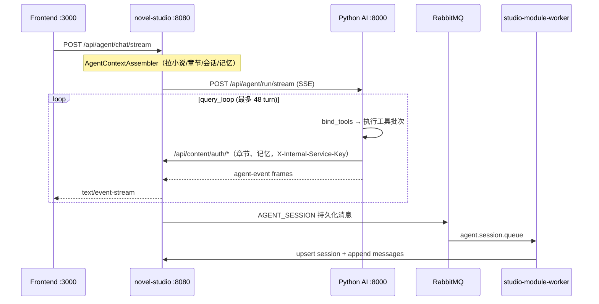

# 写小说 AI Agent — 项目架构文档

> 本文档基于仓库当前代码（novel-studio 单体）与部署配置整理，面向新成员 onboarding 与架构评审。
> 协作规范与重启流程以根目录 [`CLAUDE.md`](../CLAUDE.md) 为准；架构/部署速查见 [`.cursor/rules/project-architecture.mdc`](../.cursor/rules/project-architecture.mdc) 与 [`.cursor/rules/deploy-ops.mdc`](../.cursor/rules/deploy-ops.mdc)。
> 文档版本：2026-06-17

---

## 1. 项目概述

### 1.1 业务定位

本项目是一套**网文创作 AI 助手**全栈系统：用户在 Web 编辑器中管理小说/章节，通过对话式 Agent 完成续写、改写、大纲、角色对话、校对、故事记忆维护等任务。Agent 行为对齐 **Claude Code（CC）** 风格的工具编排：多轮 `bind_tools`、结构化输出、工具结果双通道（模型正文 vs UI 摘要）、子 Agent 嵌套等。

### 1.2 技术栈总览

| 层级 | 技术 | 目录 |
|------|------|------|
| 前端 | React 18、Vite 5、TypeScript、styled-components、Zustand | `frontend/` |
| AI 编排 | Python 3、FastAPI、LangChain | `python-ai/` |
| 业务单体 | Java 17、Spring Boot 3.2、Sa-Token、WebFlux、MyBatis | `novel-studio/` |
| 基础设施 | Docker Compose（PostgreSQL、Redis、RabbitMQ、可选 Milvus） | `infra/` |
| 参考实现 | Claude Code 源码（只读对照） | `.cursor/.../claude-code-ref/` |

### 1.3 设计边界（重要）

| 职责 | 归属 | 不做的事 |
|------|------|----------|
| LLM 调用、Agent 循环、工具执行、RAG 索引 | **Python AI** (`python-ai/`) | 用户系统、业务库主写、鉴权 |
| 鉴权、限流、会话/章节持久化、SSE 网关、MQ 生产与消费 | **novel-studio** (`novel-studio/`) | 直接调 LLM（经 Python AI） |
| 编辑器 UI、SSE 消费、本地会话缓存 | **Frontend** (`frontend/`) | 业务规则与 Agent 编排 |
| 关系库、缓存、消息队列 | **infra / MW** | 应用逻辑 |

---

## 2. 仓库结构

```
agent/                          # monorepo 根
├── frontend/                   #  Vite SPA（:3000）
├── python-ai/                  #  FastAPI AI 服务（:8000）
├── novel-studio/               #  生产单体 JVM（:8080）
│   └── studio-modules/
│       ├── studio-module-auth/      #  鉴权
│       ├── studio-module-content/   #  小说/章节/会话/记忆/爬虫任务/CRM
│       ├── studio-module-agent/     #  Agent SSE 网关、编排、副作用
│       ├── studio-module-billing/   #  计费
│       └── studio-module-worker/    #  MQ 监听（会话/记忆/爬虫派发/权限）
├── legacy/novel-agent/         #  旧 Spring Cloud 微服务（已废弃，勿部署；仅保留 CI 部署脚本与历史对照）
├── infra/                      #  Docker 本地中间件
├── docs/                       #  设计与架构文档（本文档）
└── CLAUDE.md                   #  AI/开发者协作规范
```

---

## 3. 运行时拓扑

### 3.1 生产双机拓扑（novel-studio 单体，2026 起）

| 角色 | 主机 | 服务 |
|------|------|------|
| **MW** | `107.150.112.140` | entry-nginx、PostgreSQL、Redis、RabbitMQ |
| **Worker** | `47.80.80.224` | **novel-studio :8080**（单体 JVM）、python-ai :8000、python-lb、frontend |
| **域名** | https://www.novel-agent.cn | 浏览器 → MW Nginx → Worker frontend → `/api/*` → novel-studio |

```
Frontend :3000 → novel-studio :8080（Auth / Content / Agent / Billing 模块）
novel-studio ──HTTP──→ python-ai :8000（query_loop、工具、爬虫编排）
python-ai ──HTTP──→ novel-studio :8080 /api/content/auth/*（X-Internal-Service-Key + X-User-Id）
```

| 服务 | 端口 | 模块路径 | 说明 |
|------|------|----------|------|
| Frontend | 3000 | `frontend/` | Vite SPA |
| novel-studio | 8080 | `novel-studio/studio-modules/*` | 单体 JVM |
| Python AI | 8000 | `python-ai/` | Agent 编排 + RAG + 爬虫 |
| MW Nginx | 80/443 | `novel-agent/.../nginx-*`（CI 部署） | 反代 + TLS |

### 3.2 本地开发与验收

> **`restart-dev.sh` 已于 2026-06-05 废弃**（本地 Consumer 连生产 MQ 会抢线上队列）。

| 场景 | 做法 |
|------|------|
| 前端 UI 小改 | `cd frontend && npm run dev`（**勿**启 Consumer / 勿连生产 MQ） |
| 全栈联调 | 部署到 Worker 后在线验收 |
| 中间件本地 | `cd infra && docker compose up -d`（PostgreSQL / Redis / RabbitMQ） |

**验收**：https://www.novel-agent.cn

---

## 4. 核心请求链路

### 4.1 Agent 对话主路径（SSE）

系统最核心的端到端流程：



**Java 入口类（`studio-module-agent`）：**

- `controller/AgentStreamController` — `POST /api/agent/chat/stream`
- `service/AgentBridgeService` — 桥接编排
- `orchestration/AgentRunCoordinator` — Run 生命周期、副作用
- `orchestration/AgentRunRegistry / AgentRunState` — 运行态注册表（支持恢复）
- `service/AgentContextAssembler` — 组装上下文
- `service/ChapterSideEffectService` — 章节写入副作用
- `mq/AgentRunMqPublisher` — 异步持久化

**Python 入口：**

- `app/agent/router.py` — `POST /api/agent/run/stream`
- `app/agent/loop.py` — `run_query_loop`

**前端入口：**

- `hooks/editor/useEditorAgentStream.ts` — `openAgentStream`
- `utils/agentStreamState.ts` — SSE 事件 reducer
- `components/agent/timeline/AssistantStreamTimeline.tsx` — 可视化

### 4.2 Content CRUD 路径

- 浏览器：`/api/content/*` → novel-studio `studio-module-content`（JWT + 客户端 Sign/AES）
- **python-ai 工具**（WriteChapter、WriteMemory 等）：`CONTENT_BASE_URL=http://novel-studio:8080`，路径 `/api/content/auth/*`，请求头 `X-Internal-Service-Key` + `X-User-Id`（`ClientAuthSupport.isTrustedServiceContentAuth`）

### 4.3 认证路径

- 登录/注册：`/api/auth/*` → `studio-module-auth`（Sa-Token）
- novel-studio 统一鉴权过滤校验 token 并注入 `X-User-Id`

---

## 5. 各子系统详解

### 5.1 Frontend（`frontend/`）

**职责：** 营销页、登录注册、小说编辑器、AI 聊天面板、SSE 流式 UI、章节 diff、故事记忆弹窗、爬虫 CRM 管理台。

| 路径 | 说明 |
|------|------|
| `src/pages/EditorPage.tsx` | 主编辑页 |
| `src/hooks/editor/useEditorAgentStream.ts` | Agent SSE 主逻辑 |
| `src/utils/api.ts` | REST + `openAgentStream` + WebSocket |
| `src/utils/agentStreamState.ts` | 事件 → UI 状态 |
| `src/stores/novelStore.ts` | 章节与 Agent 流式写入 |
| `src/components/agent/timeline/` | 工具行、子 Agent、规划栈 |
| `src/pages/admin/CrawlerPage.tsx` | 爬虫 CRM 管理台 |
| `src/security/` | 客户端 AES/Sign/路由脱敏 |

**SSE 与 UI 双通道对齐 CC：** 模型侧工具结果经截断后回灌 `ToolMessage`；UI 侧 `display_excerpt`、`output_summary` 仅前端展示。

### 5.2 Python AI（`python-ai/`）

**职责：** LLM 提供方、Agent 主循环、CC 风格工具集、上下文压缩、RAG 索引 API、爬虫主编排。

**主循环（`app/agent/loop.py`）：**

```
run_query_loop
  → enrich_context + 从 Content 刷新章节目录
  → while turn < limit:
      → 上下文计量 / microcompact / autocompact
      → stream_bind_tools_turn（LLM 选工具）
      → validate_plan_batch（orchestration_contract）
      → execute_tool_batches（并行读、串行写）
      → AskUser → wait_for_user_interaction
      → 合并 context_patch
```

**关键模块：**

| 模块 | 路径 | 职责 |
|------|------|------|
| 工具注册 | `app/agent/tools/registry.py` | `get_all_tools()` |
| 工具执行 | `app/agent/tools/run_tool_use.py` | 校验、hooks、tool_use_error |
| 双通道路由 | `app/agent/harness/tool_result_routing.py` | 模型 vs SSE UI |
| VFS 章节 | `app/agent/backend/chapter_store.py` | httpx → Content API |
| Story Memory | `app/agent/backend/memory_store.py` | httpx → Content memory API |
| 编排契约 | `app/agent/harness/` | 批次规则、system prompt、计划上下文 |
| RAG | `app/rag/chapter_index.py` | 内存索引 + 可选 Milvus |
| 爬虫主编排 | `app/crawl/orchestrator/` | 拆 goal → CrawlJob |
| 子爬虫 Agent | `app/crawl/agent/` | 工具驱动；书库 CRUD |

详见 [`python-ai/AGENTS.md`](../python-ai/AGENTS.md)。

### 5.3 novel-studio 单体（`novel-studio/`）

生产单体，模块化。父工程：「写小说 AI Agent」Spring Boot 3.2 + Sa-Token。

#### studio-module-agent

**Agent SSE 网关层**，不做 LLM 推理：

- `AgentStreamController` — `POST /api/agent/chat/stream`
- `AgentContextAssembler` — 组装上下文（Content 上下文 + 用户消息 + 历史）
- `AgentBridgeService` + WebClient 代理 Python SSE
- `ChapterSideEffectService` — 章节写入副作用
- `AgentRunCoordinator / AgentRunRegistry / AgentRunState` — Run 生命周期与恢复
- `AgentRunMqPublisher` — Run 结束后发 MQ 异步持久化
- `PgRunEventFanout / HostModeEventFanout / SseEventCodec` — SSE 编码与事件分发

#### studio-module-content

**业务数据主库 + 爬虫任务/书库：**

- 小说、章节、版本、卷
- 会话与消息（Agent 对话历史）
- Story Memory（结构化故事设定）
- `controller/auth/AuthNovelAgentContextController` — 组装 Agent 上下文
- `controller/internal/*` — python-ai 内部回调（`X-Internal-Service-Key`）
- `controller/crm/*` — 爬虫 CRM 统计与书库
- `crawl/` — CrawlJob、Catalog、Redis 编排状态

#### studio-module-worker

**MQ 监听**，HTTP 回写 Content：

| 监听器 | 队列 | 行为 |
|--------|------|------|
| `AgentSessionListener` | `agent.session.queue` | 持久化会话消息 |
| `AgentRunEventsListener` | `agent.run.events.queue` | Run 事件落库（owner SSE 热路径异步 persist） |
| `CatalogIndexListener` | 章节索引 | 触发向量索引 |
| `CrawlDispatchListener` | `crawl.dispatch` | 爬虫子任务派发 |
| `PermissionListener` | `permission.queue` | 权限同步（Redis） |

> 注：旧 `agent-consumer:8090` 的职责已并入本模块；生产不再有独立 Consumer 进程。

#### studio-module-auth

用户注册登录（Sa-Token）；登录后发 `PERMISSION` MQ 消息。

#### studio-module-billing

计费、套餐、审计日志；含 CRM 管理接口。

### 5.4 基础设施（`infra/`）

| 组件 | 端口 | 用途 |
|------|------|------|
| PostgreSQL | 5432 | 业务库 `novel_agent` |
| Redis | 6379 | 缓存、权限、爬虫编排状态 |
| RabbitMQ | 5672 / 15672 | 异步持久化与派发 |
| Milvus（profile vector） | 19530 | 可选章节向量 |

---

## 6. 数据与存储模型

### 6.1 持久化分工

| 数据类型 | 主存储 | 写入路径 |
|----------|--------|----------|
| 用户账号 | PostgreSQL（auth） | 同步 REST |
| 小说/章节正文 | PostgreSQL（content） | REST；Agent Write 经 Python `chapter_store` → Content API |
| 会话消息 | PostgreSQL（content） | 同步 + MQ 异步（Run 结束） |
| Story Memory | PostgreSQL（content） | patch API + MQ 异步 |
| 权限缓存 | Redis | worker 监听 PERMISSION |
| 爬虫编排状态 | Redis | content crawl 模块 |
| 章节向量 | 内存 dict / Milvus | Python `chapter_index`；Content 可触发 reindex |

### 6.2 Agent 虚拟文件系统（VFS）

Agent 的章节/记忆工具**不访问本机磁盘**，而是：

- **章节路径** → `app/agent/backend/chapter_store.py` → Content API（`X-User-Id` 头）
- **记忆路径** → `app/agent/backend/memory_store.py` → story-memory HTTP API

权威目录在 Run 上下文中的 `chapter_catalog` / `memory_catalog`。

### 6.3 RAG

- 索引 API：`POST /api/rag/index/chapter`
- 检索：`POST /api/rag/search`
- Agent 主循环默认通过 Read/Grep + Content 获取上下文，而非每步自动 RAG
- Embedding：OpenAI `text-embedding-3-small` 或 hash fallback

---

## 7. Agent 编排与 CC 对齐

### 7.1 工具清单（核心）

`ListChapters` `ReadChapter` `WriteChapter` `EditChapter` `DeleteChapter` `ReorderChapters` ·
`ListMemory` `ReadMemory` `WriteMemory` `EditMemory` `DeleteMemory` ·
`SearchKnowledge` `GetCharacterGraph` ·
`AskUser` `TodoWrite` `Agent` ·
`WebSearch` `WebFetch` `Skill` `MCP`

旧 VFS 工具（`Read`/`Write`/`Glob`/`Grep`/`ToolSearch` 等）已删除。

### 7.2 工具结果双通道

| Claude Code | 本项目 |
|-------------|--------|
| `mapToolResultToToolResultBlockParam` | `ToolCallResult.content` → 回灌模型 |
| `renderToolResultMessage` | SSE `display_excerpt` / `tool_ui` |
| `processToolResultBlock` | `truncate_tool_result` |
| StructuredOutput + Ajv | `PlanResult` Pydantic + retry HumanMessage |

参考源码路径：`.cursor/rules/claude-code-ref.mdc` 所列 `claude-code-ref/src/`。

### 7.3 上下文策略

- `context_meter` / `context_usage` — 计量 → `context.usage` SSE
- microcompact @ ~55% — 清空旧 ToolMessage 占位（`compact_micro.py`）
- autocompact @ ~72% — LLM 摘要 + `compact_boundary`（`compact_autocompact.py`）

### 7.4 SSE 事件（概念层）

前端 `agentStreamState` 处理包括但不限于：

- `reasoning.*` — 模型思考流
- `tool.started` / `tool.completed` — 工具生命周期
- `step.completed` — 单步完成（含 display 载荷）
- `chapter.stream.*` — 流式写章（同步 novelStore）
- `subagent.*` — 子 Agent
- `context.usage` — 上下文占用
- `stream-end` — Run 结束

---

## 8. 消息队列异步流

```
novel-studio (Run 结束) ──AGENT_SESSION──► agent.session.queue ──► studio-module-worker ──► Content API
novel-studio (memory patch) ──STORY_MEMORY──► agent.story-memory.queue ──► worker ──► Content internal persist
novel-studio (登录) ──PERMISSION──► permission.queue ──► worker ──► Redis
novel-studio (爬虫) ──crawl.dispatch──► crawl.dispatch.queue ──► worker ──► python-ai crawl_agent
```

设计动机：SSE 主路径保持低延迟；会话与记忆的大块持久化走 MQ 削峰，由 `studio-module-worker` 统一回写。

---

## 9. 安全与配置

- **API Key / LLM 密钥：** 仅环境变量，禁止硬编码（见 `python-ai/app/config.py`）
- **用户身份：** `X-User-Id` 由 novel-studio 注入，python-ai/content 信任上游
- **服务间鉴权：** python-ai → content 走 `X-Internal-Service-Key`
- **客户端安全（Phase 0e）：** AES 传输层、路由脱敏、字段加密、请求签名、前端混淆、邮箱验证、401 自动 refresh。详见 `.cursor/rules/security-deploy.mdc`

---

## 10. 修改代码后的部署策略

| 改动范围 | 动作 |
|----------|------|
| `python-ai/` Agent、工具、提示词、爬虫编排 | 部署 Worker python-ai（CI `deploy-python-ai.yml`） |
| `novel-studio/` Java | 部署 Worker novel-studio（CI `deploy-novel-studio.yml`） |
| `frontend/` 仅 TSX/CSS | 本地 HMR；线上 `deploy-frontend.yml` |
| `frontend/` 依赖 / vite.config / security | CI frontend |
| 仅文档/测试 | 不必 |

跨 Python + Java + 前端的多文件重构、SSE 协议变更 → CI 全量或手动多选 deploy。详见 `.cursor/rules/deploy-ops.mdc`。

---

## 11. 爬虫与主编排（Crawl Orchestrator）

独立于编辑器 Agent 的**常驻主编排**，负责将 CRM「总目标」拆成 `CrawlJob` 子任务并调度子爬虫 Agent。

```
CRM CrawlerPage → content CRM API → Redis 编排状态
python-ai crawl_orchestrator daemon → internal Content API（Create/Pause/Cancel job）
子 CrawlJob → MQ crawl.dispatch → python-ai crawl_agent（FetchPage/书库工具）
```

| 组件 | 路径 |
|------|------|
| 主编排 loop / prompt | `python-ai/app/crawl/orchestrator/` |
| 子 Agent 工具 | `python-ai/app/crawl/agent/` |
| Content 任务/书库/内部 API | `novel-studio/.../studio-module-content/.../crawl/` |
| CRM 管理页 | `frontend/src/pages/admin/CrawlerPage.tsx` |

要点：槽位 RUNNING+PAUSED ≤ 3；禁止重复 `sourceUrl`；「爬 N 本」= 1 发现 job + 每书 1 job；`CRAWL_ORCHESTRATOR_ENABLED=true`（Worker `python-ai/.env`）。

---

## 12. 关键文件索引

### 入口与配置

| 文件 | 说明 |
|------|------|
| `CLAUDE.md` | 协作规范 |
| `.cursor/rules/project-architecture.mdc` | AI 架构速查 |
| `.cursor/rules/deploy-ops.mdc` | AI 部署速查 |
| `novel-studio/deploy/README.md` | 生产部署指南 |
| `python-ai/app/main.py` | FastAPI 入口 |
| `python-ai/app/config.py` | Python 配置 |
| `frontend/vite.config.ts` | 开发代理 |

### Agent 全链路

| 文件 | 说明 |
|------|------|
| `frontend/src/hooks/editor/useEditorAgentStream.ts` | 前端 SSE |
| `novel-studio/.../studio-module-agent/.../AgentStreamController.java` | Java SSE 入口 |
| `python-ai/app/agent/loop.py` | Agent 主循环 |
| `python-ai/app/agent/harness/tool_result_routing.py` | 双通道路由 |
| `python-ai/app/crawl/orchestrator/` | 爬虫主编排 |
| `frontend/src/pages/admin/CrawlerPage.tsx` | CRM 爬虫页 |

---

## 13. 架构原则小结

1. **关注点分离：** Python 管「怎么想、怎么用工具」；novel-studio 管「谁在用、存哪里、怎么推 SSE」；前端管「怎么呈现、怎么交互」。
2. **主路径同步、辅路径异步：** Agent 推理与工具执行为 HTTP SSE 同步链；会话/记忆持久化走 MQ。
3. **VFS 抽象内容：** 工具面向「小说章节/记忆路径」，而非 OS 文件，保证多租户与权限一致。
4. **CC 对齐可维护：** 工具错误回灌、双通道结果、StructuredOutput 等行为有本地 `claude-code-ref` 可对照。
5. **单体优先：** 微服务已归档至 `legacy/novel-agent/`，新功能只改 `novel-studio/` + `python-ai/` + `frontend/`。

---

*文档版本：2026-06-17 · 与仓库代码同步维护；AI 持久记忆见 `.cursor/rules/project-architecture.mdc` 与 `deploy-ops.mdc`。*
