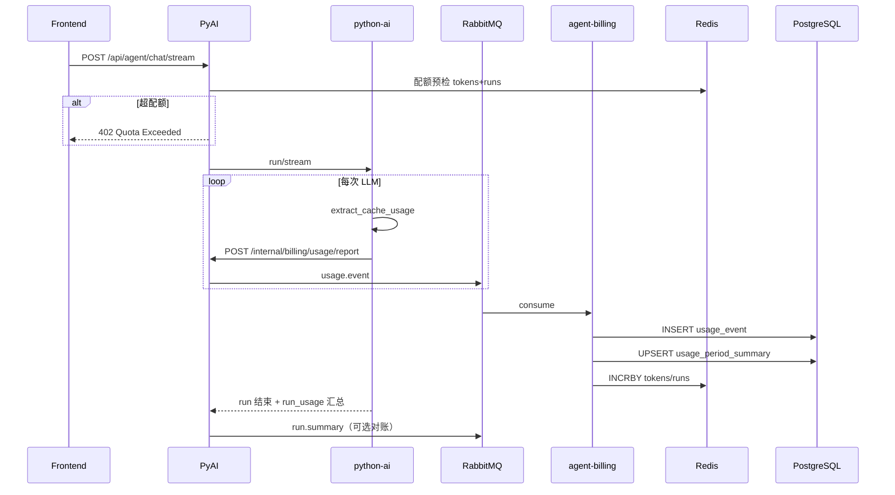

# 平台运营与基础设施补齐 — 设计规格

> **版本**：2026-06-08  
> **状态**：待实施  
> **配套实施计划**：
> - Phase 8：`docs/superpowers/plans/2026-06-08-phase8-infra-operations.md`
> - Phase 9：`docs/superpowers/plans/2026-06-08-phase9-product-billing.md`
> - Phase 10：`docs/superpowers/plans/2026-06-08-phase10-admin-operations.md`
> **总索引**：`docs/superpowers/plans/2026-06-07-implementation-index.md`

---

## 1. 背景与目标

Phase 1–7 已完成 Agent 工具链、知识库、Harness 持久化、工程化门禁、爬虫重构与前端优化。**创作产品**已可运行；**平台运营层**（基础设施闭环 + 商业化 + 治理后台）仍大量停留在 UI 骨架或设计文档。

本规格定义两类补齐目标：

| 类别 | 目标 |
|------|------|
| **A. 基础设施运营** | 可观测平台、DB 治理、预发环境、CI 硬化、RAG 生产依赖、安全边界 |
| **B. 产品运营商业** | 定价模型、计量账本、配额 enforcement、用户用量透明、管理端闭环、支付订阅 |

**成功标准（KPI）**：

| 指标 | 现状（估） | 目标 |
|------|-----------|------|
| 故障定位时间（P1） | 依赖 SSH 翻日志 | < 15 分钟（trace_id + 集中日志） |
| DB schema 变更 | `ddl-auto: update` | 100% Flyway migration |
| 用户 Token 用量可见 | Billing 页演示数据 | 100% 真实数据，延迟 < 1 分钟 |
| 超配额拦截 | 无 | 100% Agent 入口拦截 |
| 单次 Run 追溯 | 仅 llm_trace 文件 | runId → usage_event → trace_id 全链路 |
| Admin 运营闭环 | 用户/爬虫/书库 | + 套餐/用量/站点/审计/成本 |
| 定价页与后台一致 | 前端硬编码 | 单一数据源（DB/Nacos） |

---

## 2. 现状盘点

### 2.1 已具备（可复用）

| 能力 | 位置 | 说明 |
|------|------|------|
| 双机部署 | MW + Worker | Gateway/Auth/MQ/PG vs 业务/python-ai/前端 |
| CI/CD | `.github/workflows/ci.yml`、`deploy-split.yml` | 三语言 lint/test + push 热部署 |
| 健康/指标端点 | `actuator.yml`、python `/metrics` | 代码层已暴露，**无采集平台** |
| trace_id | `TraceIds.java`、`TraceIdServletFilter`、python `TraceIdMiddleware` | 日志字段有，**无集中检索** |
| 回滚 | `rollback.sh` | jar 备份回滚 |
| 安全传输 | AES/路由脱敏/字段加密/签名 | 应用层完整 |
| 用户/Admin CRM | `/admin` 用户 CRUD、平台统计、爬虫、书库 | 运营向，**非商业向** |
| 用户创作统计 | `/api/content/auth/dashboard/*` | 小说/章节/字数/Agent 次数 |
| 单次 Run Token（内存） | `RunUsageAccumulator`、SSE `context.usage` | **不落库** |
| 角色 | `AuthUser.role` = user/vip/admin | **无 plan/subscription** |
| 限流 | `RateLimitService` | 验证码/发信防刷，**非产品配额** |

### 2.2 骨架 / 占位（需替换为真功能）

| 模块 | 路径 | 问题 |
|------|------|------|
| 定价页 | `frontend/src/pages/PricingPage.tsx` | `TIERS` 硬编码，按钮无行为 |
| 账单页 | `frontend/src/pages/dashboard/BillingPage.tsx` | 标注「演示数据」，无 API |
| 设置页 | `frontend/src/pages/dashboard/SettingsPage.tsx` | 重定向 `/dashboard` |
| 法律/联系页 | `frontend/src/pages/GenericContentPage.tsx` | Lorem ipsum 占位 |
| VIP 限流/月度额度 | `想法.md` §6 | 未实现 |
| Prometheus/Grafana | `prometheus-alerts.yml` 模板 | **未部署** |
| Flyway | — | **不存在** |
| Milvus 生产 | 仅 `infra/` 本地 optional | Worker/MW compose **无 Milvus** |
| E2E | — | 无 Playwright |
| 支付/订阅 | — | 无表、无 API、无 webhook |

### 2.3 架构边界（实施时遵守）

```
┌─────────────────────────────────────────────────────────────┐
│  Frontend — 定价/账单/Admin 运营 UI                          │
└───────────────────────────┬─────────────────────────────────┘
                            │ secureFetch / Gateway
┌───────────────────────────▼─────────────────────────────────┐
│  agent-gateway — 鉴权、签名、CRM 过滤、配额预检（Phase 9）      │
└───────┬───────────────────────────────┬─────────────────────┘
        │                               │
┌───────▼────────┐              ┌───────▼────────────────────┐
│  agent-auth    │              │  agent-billing（新模块）     │
│  用户/订阅     │◄──Feign──────│  计量/套餐/账单/站点 CMS     │
└───────┬────────┘              └───────▲────────────────────┘
        │                               │
┌───────▼────────┐              ┌───────┴────────────────────┐
│  agent-pyai    │──上报/MQ────►│  usage_event 持久化         │
│  配额拦截      │              │  Redis 周期计数             │
└───────┬────────┘              └────────────────────────────┘
        │
┌───────▼────────┐
│  python-ai     │  LLM 调用结束 → 上报 token/cost
└────────────────┘
```

**模块归属决策**：

- 新建 **`agent-billing`** Spring Boot 模块（推荐），职责：套餐、订阅、计量账本、账单汇总、站点 CMS、审计日志、Admin 运营 API。
- `agent-auth` 保留：登录注册、JWT、用户 CRUD；`user_subscription` 可通过 Feign 读 billing，或 billing 持有 subscription 表并通过 internal API 同步 role。
- 计量写入：**MQ 异步**（`usage.event.queue`），避免 LLM 热路径阻塞；Consumer 落 PG + 更新 Redis。

---

## 3. 缺口矩阵

### 3.1 基础设施（Phase 8）

| # | 缺口 | 风险 | 优先级 |
|---|------|------|--------|
| I1 | 无 Prometheus/Grafana/Loki 部署 | 故障 blind | P0 |
| I2 | `ddl-auto: update` | schema 漂移 | P0 |
| I3 | 无 PG 备份 | 数据丢失 | P0 |
| I4 | Milvus 未上生产 | RAG 不可用/不稳定 | P0 |
| I5 | CI：`mypy` continue-on-error、`skipITs` | 质量门禁虚设 | P1 |
| I6 | 无 staging 环境 | 只能 prod 验收 | P1 |
| I7 | 无 OpenTelemetry | 跨服务排障慢 | P1 |
| I8 | 无 E2E | 回归靠人工 | P1 |
| I9 | 无 CSP/Sentry/WAF | 边界安全弱 | P2 |

### 3.2 产品商业（Phase 9–10）

| # | 缺口 | 风险 | 优先级 |
|---|------|------|--------|
| P1 | 无 `usage_event` 账本 | 无法计费/追溯 | P0 |
| P2 | 无配额 enforcement | 成本失控 | P0 |
| P3 | Billing 页假数据 | 用户不信任 | P0 |
| P4 | 定价页与后台脱节 | 运营无法改价 | P1 |
| P5 | 无订阅/支付 | 无法变现 | P1 |
| P6 | Admin 无套餐/成本看板 | 运营 blind | P1 |
| P7 | 无站点 CMS | 法律页占位 | P2 |
| P8 | 无审计日志 | 合规/追责难 | P2 |
| P9 | `vip` role 与 plan 混用 | 双真相 | P2 |

---

## 4. 数据模型

### 4.1 套餐与订阅

```sql
-- 套餐定义（Admin 可 CRUD，Pricing 页读取）
CREATE TABLE product_plan (
  id              BIGSERIAL PRIMARY KEY,
  code            VARCHAR(32) NOT NULL UNIQUE,  -- hobby, pro, enterprise
  name            VARCHAR(64) NOT NULL,
  description     TEXT,
  price_cents     INT,                          -- NULL = 面议
  currency        VARCHAR(8) DEFAULT 'CNY',
  billing_interval VARCHAR(16) DEFAULT 'month', -- month | year
  monthly_token_quota BIGINT,                   -- NULL = unlimited
  monthly_run_quota   INT,
  rate_limit_rpm      INT DEFAULT 60,
  overage_policy  VARCHAR(32) DEFAULT 'block',  -- block | pay_as_you_go | contact
  is_active       BOOLEAN DEFAULT TRUE,
  sort_order      INT DEFAULT 0,
  created_at      TIMESTAMPTZ DEFAULT NOW(),
  updated_at      TIMESTAMPTZ DEFAULT NOW()
);

CREATE TABLE plan_feature (
  id        BIGSERIAL PRIMARY KEY,
  plan_id   BIGINT NOT NULL REFERENCES product_plan(id),
  feature_key VARCHAR(64) NOT NULL,  -- pdf_export, custom_model, crawl_admin, ...
  enabled   BOOLEAN DEFAULT TRUE,
  UNIQUE(plan_id, feature_key)
);

CREATE TABLE user_subscription (
  id              BIGSERIAL PRIMARY KEY,
  user_id         BIGINT NOT NULL UNIQUE,
  plan_id         BIGINT NOT NULL REFERENCES product_plan(id),
  status          VARCHAR(16) NOT NULL,  -- active, past_due, canceled, trialing
  current_period_start TIMESTAMPTZ NOT NULL,
  current_period_end   TIMESTAMPTZ NOT NULL,
  external_sub_id VARCHAR(128),            -- Stripe / 支付宝 订阅 ID
  canceled_at     TIMESTAMPTZ,
  created_at      TIMESTAMPTZ DEFAULT NOW(),
  updated_at      TIMESTAMPTZ DEFAULT NOW()
);

-- Admin 手工 override（不影响 subscription 记录，叠加生效）
CREATE TABLE user_quota_override (
  id              BIGSERIAL PRIMARY KEY,
  user_id         BIGINT NOT NULL,
  token_bonus     BIGINT DEFAULT 0,
  run_bonus       INT DEFAULT 0,
  rate_limit_rpm  INT,
  reason          TEXT,
  expires_at      TIMESTAMPTZ,
  created_by      BIGINT,
  created_at      TIMESTAMPTZ DEFAULT NOW()
);
```

**默认套餐（seed migration）** — 对齐当前 `PricingPage.tsx` 文案，后续仅改 DB：

| code | monthly_token_quota | price_cents | features |
|------|---------------------|-------------|----------|
| hobby | 10_000 | 0 | basic_editor, txt_export |
| pro | 1_000_000 | 9900 | + pdf_export, custom_model, priority_support |
| enterprise | NULL | NULL | unlimited + team + custom_integrations |

### 4.2 计量账本（不可变）

```sql
CREATE TABLE usage_event (
  id                BIGSERIAL PRIMARY KEY,
  user_id           BIGINT NOT NULL,
  run_id            VARCHAR(64),
  session_id        VARCHAR(64),
  trace_id          VARCHAR(64),
  event_type        VARCHAR(32) NOT NULL,  -- llm_call, tool_call, crawl_chapter, cover_gen
  model             VARCHAR(64),
  input_tokens      INT DEFAULT 0,
  output_tokens     INT DEFAULT 0,
  cache_read_tokens INT DEFAULT 0,
  cache_write_tokens INT DEFAULT 0,
  unit_cost_micros  BIGINT DEFAULT 0,      -- 单价快照（micro-USD 或 micro-CNY）
  total_cost_micros BIGINT DEFAULT 0,
  metadata_json     JSONB,
  created_at        TIMESTAMPTZ DEFAULT NOW()
);

CREATE INDEX idx_usage_event_user_created ON usage_event(user_id, created_at DESC);
CREATE INDEX idx_usage_event_run ON usage_event(run_id);
CREATE INDEX idx_usage_event_trace ON usage_event(trace_id);

-- 周期汇总（账单页、配额检查读此表 + Redis 热计数）
CREATE TABLE usage_period_summary (
  user_id           BIGINT NOT NULL,
  period_yyyy_mm    CHAR(7) NOT NULL,      -- 2026-06
  tokens_used       BIGINT DEFAULT 0,
  runs_used         INT DEFAULT 0,
  cost_micros       BIGINT DEFAULT 0,
  quota_tokens      BIGINT,
  quota_runs        INT,
  updated_at        TIMESTAMPTZ DEFAULT NOW(),
  PRIMARY KEY (user_id, period_yyyy_mm)
);
```

**Redis 热键**（配额实时检查）：

```
billing:usage:{userId}:{yyyyMM}:tokens   → INCRBY
billing:usage:{userId}:{yyyyMM}:runs    → INCR
billing:plan:{userId}                   → plan snapshot cache TTL 5m
```

### 4.3 站点与审计（Phase 10）

```sql
CREATE TABLE site_content (
  content_key VARCHAR(64) PRIMARY KEY,  -- privacy, terms, contact, announcement
  title       VARCHAR(256),
  body_md     TEXT NOT NULL,
  locale      VARCHAR(8) DEFAULT 'zh-CN',
  updated_at  TIMESTAMPTZ DEFAULT NOW(),
  updated_by  BIGINT
);

CREATE TABLE audit_log (
  id          BIGSERIAL PRIMARY KEY,
  actor_id    BIGINT NOT NULL,
  action      VARCHAR(64) NOT NULL,     -- user.role_change, plan.update, quota.override
  target_type VARCHAR(32),
  target_id   VARCHAR(64),
  before_json JSONB,
  after_json  JSONB,
  ip          VARCHAR(45),
  trace_id    VARCHAR(64),
  created_at  TIMESTAMPTZ DEFAULT NOW()
);
```

### 4.4 支付（Phase 10 后期）

```sql
CREATE TABLE payment_order (
  id              BIGSERIAL PRIMARY KEY,
  user_id         BIGINT NOT NULL,
  plan_id         BIGINT NOT NULL,
  amount_cents    INT NOT NULL,
  currency        VARCHAR(8) DEFAULT 'CNY',
  status          VARCHAR(16) NOT NULL,  -- pending, paid, failed, refunded
  provider        VARCHAR(16),           -- stripe, alipay
  external_id     VARCHAR(128),
  paid_at         TIMESTAMPTZ,
  created_at      TIMESTAMPTZ DEFAULT NOW()
);
```

---

## 5. API 契约

### 5.1 用户端（`/api/billing/auth/**`）

| 方法 | 路径 | 说明 |
|------|------|------|
| GET | `/plans` | 公开套餐列表（Pricing 页） |
| GET | `/usage/current` | 本月用量 + 配额 + 预估费用 |
| GET | `/usage/trends?days=30` | 按日 Token/费用曲线 |
| GET | `/usage/events?page=&pageSize=&runId=` | 明细分页，可按 runId 过滤 |
| GET | `/subscription` | 当前订阅状态 |
| POST | `/checkout` | 创建支付会话（Phase 10） |

### 5.2 管理端（`/api/billing/crm/**`，Gateway CrmGatewayFilter）

| 方法 | 路径 | 说明 |
|------|------|------|
| GET/POST/PUT | `/crm/plans` | 套餐 CRUD |
| GET | `/crm/usage/overview` | 全站 Token/成本/MRR |
| GET | `/crm/usage/user/{userId}` | 单用户用量 + 明细 |
| PUT | `/crm/user/{userId}/subscription` | 手工改 plan |
| POST | `/crm/user/{userId}/quota-override` | 临时加配额 |
| GET/PUT | `/crm/site-content/{key}` | 站点 CMS |
| GET | `/crm/audit-log` | 审计分页 |

### 5.3 内部（`/internal/billing/**`，`AGENT_INTERNAL_SERVICE_KEY`）

| 方法 | 路径 | 说明 |
|------|------|------|
| POST | `/usage/report` | python-ai / pyai 上报单条 usage_event |
| POST | `/usage/report-batch` | run 结束批量上报 |
| GET | `/quota/check?userId=&tokens=` | PyAI 入口预检（也可纯 Redis 本地读） |

### 5.4 MQ

| Exchange/Queue | 消息体 | 消费者 |
|----------------|--------|--------|
| `usage.event` → `usage.event.queue` | `UsageReportMessage` | agent-billing-consumer 或 agent-consumer 新 listener |

---

## 6. 计量链路



**与现有 `RunUsageAccumulator` 对齐**：

- SSE 仍推送 `context.usage`（实时 UI）。
- run 结束时 python 上报的 `input_tokens + output_tokens` 总和应 ≈ SSE 累计值；偏差 > 5% 打 WARN 日志。

**计价规则（可配置 `billing.model_prices` Nacos）**：

```yaml
models:
  deepseek-chat:
    input_per_1k_micros: 140
    output_per_1k_micros: 280
  gpt-4o:
    input_per_1k_micros: 2500
    output_per_1k_micros: 10000
```

---

## 7. 配额与限流策略

| 层级 | 检查点 | 行为 |
|------|--------|------|
| RPM | Gateway 或 PyAI | 按 plan.rate_limit_rpm 滑动窗口 |
| 月度 Token | PyAI stream 入口 | 超 100% → 402；80% → 响应头 `X-Quota-Warn: 0.8` |
| 月度 Run 次数 | 同上 | 同上 |
| 功能门控 | Gateway 或业务 API | 如 crawl_admin 需 plan_feature |
| VIP role | 过渡期 | 映射到 pro plan 配额；Phase 10 后 deprecated |

复用 `RateLimitService` 模式，新增 `QuotaService`（Redis + `usage_period_summary`）。

---

## 8. 前端改造清单

| 页面 | 改造 |
|------|------|
| `PricingPage` | `GET /api/billing/auth/plans`；CTA → 登录后 checkout 或 contact |
| `BillingPage` | 接 `/usage/current`、`/trends`、`/events`；删除硬编码 |
| `GenericContentPage` | `GET /api/billing/auth/site-content/{key}` |
| `AccountSettingsPanel` | 展示当前 plan、用量摘要、升级链接 |
| `AdminSidebar` | + 套餐管理、用量成本、站点设置、审计日志 |
| `UsersPage` | 用户行展开：plan、本月用量、override 按钮 |
| `ContextUsageBar` | 显示「本次 run 已消耗 X tokens」（SSE + 可选 reconcile API） |

---

## 9. 分阶段路线图

```
Phase 8（基础设施运营，~4 周）
  可观测平台、Flyway、备份、Milvus 生产、CI 硬化、Staging、E2E 基线

Phase 9（计量与计费，~4 周）
  agent-billing 模块、usage_event 链路、配额拦截、Billing/Pricing 真数据

Phase 10（管理运营与支付，~4 周）
  Admin 套餐/CMS/审计/成本看板、Stripe/支付宝、发票雏形
```

Phase 8 与 Phase 9 **可部分并行**（9 的 DB migration 需 Flyway 基建先就绪）。

---

## 10. 风险与缓解

| 风险 | 缓解 |
|------|------|
| 计量丢失（MQ 失败） | python 本地缓冲 + 重试；Consumer 幂等键 `runId+seq` |
| 双计数（SSE vs 账本） | run 结束对账 job；以 PG 为准 |
| billing 新模块运维负担 | 首版合入 agent-auth DB schema，独立 jar 同 Worker 部署 |
| 支付合规 | Phase 10 前仅手工开通；PCI 走 Stripe 托管 |
| MW 内存不足加 Milvus | 独立向量机或 Zilliz Cloud |

---

## 11. 文件索引（实施时创建）

| 操作 | 路径 |
|------|------|
| 新建 | `novel-agent/agent-service/agent-billing/` |
| 新建 | `novel-agent/agent-feign/agent-feign-billing/` |
| 新建 | Flyway `db/migration/V*__billing_*.sql` |
| 新建 | `frontend/src/api/billingApi.ts` |
| 新建 | `frontend/src/pages/admin/PlansPage.tsx` 等 |
| 修改 | `frontend/src/pages/PricingPage.tsx`、`BillingPage.tsx` |
| 修改 | `python-ai/app/agent/harness/main_loop_llm.py`（上报） |
| 修改 | `agent-pyai` `AgentStreamController`（配额预检） |
| 新建 | `novel-agent/agent-document/docs/deploy/docker/docker-compose.observability.yml` |

---

## 12. 验收场景（E2E 级）

| 场景 | 预期 |
|------|------|
| 免费用户连发 Agent 至超 10k tokens | 返回 402，Billing 页显示真实用量 |
| Admin 改用户 plan 为 Pro | Pricing 不变；用户配额立即变为 1M |
| 用户点击 Billing 明细 runId | 跳转编辑器或展示该 run 的 usage_event 列表 |
| 改隐私政策 Admin CMS | 前端 `/privacy` 显示新内容 |
| LLM 调用后 1 分钟内 | Billing 页用量递增 |
| Grafana | 可见各服务 up、5xx 率、MQ 深度 |
| staging 部署 | master 先上 staging，手动 promote prod |
