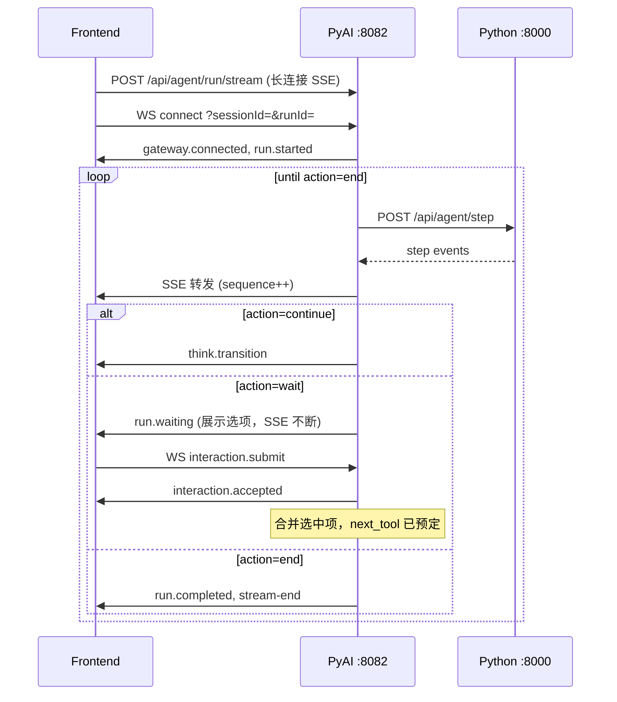

# Agent 步进编排架构设计（Java 编排 + Python 单步执行）

> 状态：已评审（v2）  
> 日期：2026-05-29  
> 决策：**LLM 每步只输出 JSON（强约束 structured output）**；**长连接 SSE + 双向 WS**；用户交互与暂停不中断 SSE。

## 1. 背景与目标

### 1.1 现状问题

- Python 内 LangGraph ReAct 一次跑完，编排与执行耦合。
- 预思考（preflight）与 ReAct 指令冲突，导致 `think.delta` 泄漏元推理。
- `host_mode` 整轮重试放大问题；Java 仅透传 SSE，无法单步恢复。
- 前端虽是一条 SSE，但后端语义是「一次 HTTP = 一整轮 ReAct」，难以插入步间过渡（「正在思考下一步」）。

### 1.2 目标

| 目标 | 说明 |
|------|------|
| Java 编排 | 每步调用 Python 一次；根据 JSON 的 `action` 决定是否继续 |
| Python 执行 | 单步 LLM + 工具副作用；策略模式注入提示词 |
| 结构化输出 | Claude Code 模式：**展示流**（think/message）与 **forced tool**（StepResult/PlanResult）分离；解析失败有 fallback |
| 前端无感 | 用户始终只连**一条长连接 SSE**；步间由 Java 拼接事件 |
| 展示与控制分离 | JSON 内 `display` 供前端；`action`/`next_tool` 供 Java |
| 交互走 WS | choose / 用户输入经 **WS 上行**，**同一 run** 恢复；**不关 SSE** |
| 无步数上限 | 单 run 不限制步数；前端可 **手动暂停/恢复** |

## 2. 架构总览

### 2.1 双通道模型

| 通道 | 方向 | 职责 |
|------|------|------|
| **SSE** | 服务端 → 前端 | 唯一展示流：`think.delta`、工具、正文、`run.*`；**整轮 run 保持连接直到 `action=end` 或用户中止** |
| **WS** | 双向 | **上行**：用户点选、补充输入、暂停/恢复/中止；**下行**：可选 ack（`interaction.accepted`） |

现有 `/api/agent/chat/status/ws` 为**单向推送**，需升级为 **双向** `AgentRunWebSocketHandler`，并按 `run_id` 绑定活跃编排。

### 2.2 时序（含 choose 等待）



**职责划分**

- **Java**：`run_id` / `sequence` 全局管理、上下文累积、`stepLoop`、**WS 等待队列**、会话持久化、MQ。
- **Python**：`AgentStepExecutor`、各 `ToolStrategy`、JSON schema 校验、**单步** SSE 事件生成（每步一次短 HTTP）。
- **Frontend**：一条 SSE + 一条 WS；`think.transition`；暂停按钮 → WS `run.pause`。

## 3. 单步 JSON Schema（Claude Code 双流模式）

### 3.0 通道划分（与 CC 对齐）

| 通道 | SSE 事件 | 内容 | 来源 |
|------|----------|------|------|
| 原生推理 | `reasoning.*` | 模型 thinking（语言不保证，默认折叠） | API `thinking` / `redacted_thinking` 块 |
| 用户可见·分析 | `think.delta` | 简体中文 Markdown | think 流式调用 **仅正文**，无 JSON |
| 用户可见·回复 | `message.delta` | 简体中文 Markdown | output 流式调用 **仅正文** |
| 编排元数据 | `plan.result` | PlanResult | forced `PlanResult` tool |
| 步进元数据 | `step.completed` | action/context_patch | forced `StepResult` tool |

**禁止**在 think/output 流式阶段拼接 StepResult JSON；`DisplayContentStreamParser` 已弃用。Java `step.llm.delta` → JSON 抽取桥接对 output **不再依赖**（Python 直出 `message.*`）。

实现：`structured_llm.py` + `structured_submit.py`；`stream_channels.LlmStreamPart` 供 executor 路由。

原 `response_format: json_schema` 在 MiniMax 不可靠；主路径为 **tool_choice 锁定工具名**，文本 JSON 抽取仅 fallback。

### 3.1 `StepResult`（LLM 唯一输出）

```json
{
  "version": 1,
  "step_kind": "think",
  "action": "continue",
  "next_tool": "choose",
  "next_input": {
    "topic": "续写方向",
    "context": "前文悬念落在…"
  },
  "context_patch": {
    "pending_reason": "方向不明确"
  },
  "display": {
    "type": "think",
    "title": "分析请求",
    "content": "## 任务理解\n用户请求续写…\n## 执行计划\n1. …",
    "stream": true
  },
  "reason": "需用户选择方向后再撰写"
}
```

### 3.2 字段定义

| 字段 | 类型 | 必填 | 说明 |
|------|------|------|------|
| `version` | int | 是 | 固定 `1`，便于演进 |
| `step_kind` | string | 是 | 本步实际执行的工具名：`think`/`choose`/`write`/… |
| `action` | enum | 是 | `continue` \| `wait` \| `end` |
| `wait_for` | string | `action=wait` 时必填 | `interaction`（等 WS 用户输入） |
| `next_tool` | string | `continue`/`wait` 时必填 | 下一步工具；`end` 时填 `"end"` |
| `next_input` | object | 否 | 下一步工具入参，由对应 Strategy 解释 |
| `context_patch` | object | 否 | 合并进 `AgentRunContext` |
| `display` | object | 是 | 本步用户可见内容（见 3.3） |
| `reason` | string | 是 | 给 Java 日志与调试；不直接展示 |

### 3.3 `display` 对象

| `display.type` | 含义 | Java 映射事件 |
|----------------|------|----------------|
| `think` | 结构化思考正文 | `think.started` → `think.delta*` → `think.completed` |
| `message` | 助手自然语言回复 | `message.started` → `message.delta*` → `message.completed` |
| `tool` | 工具结果摘要（如选项） | `tool.started` / `tool.completed` + payload |
| `none` | 无用户可见内容 | 仅 `step.completed` |

| 字段 | 说明 |
|------|------|
| `title` | 思考块标题，默认「分析请求」 |
| `content` | 展示文本；`think` 时为 Markdown |
| `stream` | `true` 时 Java/Python 拆 2–6 字推 `think.delta` / `message.delta` |
| `choices` | `type=tool` 且工具为 `choose` 时的选项数组 |
| `interaction` | `single_select` / `user_input` 等交互结构 |

### 3.4 `action` 语义

| `action` | `next_tool` | Java 行为 | SSE |
|----------|-------------|-----------|-----|
| `continue` | 非 `end` 的工具名 | 合并 `context_patch` → `think.transition` → 立即调下一步 | **保持** |
| `wait` | 恢复后要执行的工具（如 `write`） | 发 `run.waiting` → **阻塞 stepLoop**，等 WS `interaction.submit` → 合并选中项 → 按 `next_tool` 继续 | **保持，不关流** |
| `end` | `"end"` | 发 `run.completed` + `stream-end` | **关闭** |

**choose 典型 `StepResult`（等待用户点选，同一 run）：**

```json
{
  "step_kind": "choose",
  "action": "wait",
  "wait_for": "interaction",
  "next_tool": "write",
  "next_input": { "task": "按用户所选方向续写" },
  "display": {
    "type": "tool",
    "tool": "choose",
    "choices": [
      { "id": "opt-1", "title": "方向A", "description": "…" },
      { "id": "opt-2", "title": "方向B", "description": "…" },
      { "id": "opt-3", "title": "方向C", "description": "…" }
    ],
    "interaction": {
      "type": "single_select",
      "prompt": "请选择一个方向继续创作"
    }
  },
  "reason": "等待用户选择续写方向"
}
```

用户点选后，前端经 WS 发送（**不新开 SSE、不新开 run**）：

```json
{
  "type": "interaction.submit",
  "run_id": "run_xxx",
  "payload": {
    "type": "single_select",
    "selected": [{ "id": "opt-1", "title": "方向A" }]
  }
}
```

Java 写入 `context_patch.selected_choice`，唤醒 stepLoop，下一步 `tool=write`，`tool_input` 合并选中标题。

### 3.5 校验规则（Python Pydantic）

1. `action=continue` ⇒ `next_tool` 必须存在且 ∈ 注册表。
2. `action=wait` ⇒ `wait_for=interaction` 且 `next_tool` 非 `end`；`display` 含 `choices` 或 `interaction`。
3. `action=end` ⇒ `next_tool` 必须为 `"end"`。
4. `display` 必填；`type=think` 时 `content` 非空（可兜底模板）。
5. 解析失败 / schema 违规 ⇒ 本步 `step.failed`；Java 最多重试 1 次同一步。

## 4. 工具策略（Python）

### 4.1 接口

```python
class ToolStrategy(Protocol):
    name: str

    def build_messages(self, ctx: AgentRunContext, tool_input: dict) -> list[BaseMessage]: ...

    def json_schema(self) -> dict:
        """返回 StepResult 的 JSON Schema（可扩展 display 约束）。"""

    async def execute(self, ctx: AgentRunContext, tool_input: dict) -> StepResult:
        """调用 LLM structured output，返回已校验的 StepResult。"""
```

```python
class AgentStepExecutor:
    def __init__(self, strategies: dict[str, ToolStrategy]): ...

    async def run_step(self, req: StepRequest) -> AsyncIterator[dict]:
        """产出 agent-event 字典流，末尾含 step.completed。"""
```

### 4.2 首批工具

| 工具 | Strategy | 典型后继 `next_tool` |
|------|----------|----------------------|
| `orchestrator` | 首轮路由（`tool=null`） | `think` 或 `write` |
| `think` | 结构化思考 | `write` / `choose` / `think` |
| `choose` | 三选项 | `wait` + `next_tool=write`（等同 run 内暂停等 WS） |
| `write` | 小说正文 | `end` 或 `memory_patch` |
| `memory_patch` | 记忆写入 | `end` |
| `end` | 显式收尾 | `end` |

每个 Strategy 在 `build_messages` 内注入：

- 角色与任务说明；
- **仅输出 JSON** 的硬约束 + schema 片段；
- `AgentRunContext` 中的前文、历史、模式、强度。

### 4.3 思考强度

沿用 `think_intensity`（`light`/`medium`/`deep`），在 `ThinkToolStrategy` 中映射不同 `display.content` 章节要求（与现有 `THINK_INTENSITY_SPEC` 对齐）。

## 5. 上下文模型

### 5.1 `AgentRunContext`（Java ↔ Python 每步传递）

```json
{
  "run_id": "run_xxx",
  "session_id": "session_xxx",
  "message_id": "message_xxx",
  "user_id": 2,
  "mode": "continue",
  "user_message": "继续写",
  "chapter_text": "…",
  "history": [{"role":"user","content":"…"}],
  "story_memory": "…",
  "preferences": {
    "think_mode": true,
    "think_intensity": "medium",
    "host_mode": true
  },
  "step_index": 0,
  "last_tool": null,
  "last_reason": null,
  "context_patch": {}
}
```

Java 在每次 `step.completed` 后 `merge(context_patch)` 并递增 `step_index`。

### 5.2 `StepRequest`

```json
{
  "context": { "...": "AgentRunContext" },
  "tool": "think",
  "tool_input": { "question": "…", "context": "…" }
}
```

首轮：`tool` 为 `null` 或 `"orchestrator"`，`tool_input` 含 `user_message`。

## 6. SSE 事件协议

### 6.1 事件清单（新增/变更）

| 事件 | 发出方 | 说明 |
|------|--------|------|
| `step.started` | Python | `{ tool, step_index }` |
| `step.completed` | Python | `{ action, next_tool, reason }`（不含大段 display，已流式推出） |
| `step.failed` | Python | `{ error, retryable }` |
| `think.transition` | **Java** | 步间：`{ title, from_tool, to_tool }` |
| `think.started/delta/completed` | Python/Java | 由 `display` 映射 |
| `tool.started/completed` | Python | 工具行 |
| `message.started/delta/completed` | Python | 正文 |
| `run.waiting` | Java | `{ reason, interaction }` — 等用户操作，**SSE 不断** |
| `run.paused` | Java | 用户手动暂停 |
| `run.resumed` | Java | 用户恢复 |
| `run.completed` | Java | 全流程结束 |
| `stream-end` | Java | SSE 关闭 |

**`sequence`**：由 Java 统一分配，跨多步 Python 调用、WS 等待期间均单调递增。

### 6.2 WebSocket 消息（双向）

**客户端 → Java（上行）**

| `type` | 说明 |
|--------|------|
| `interaction.submit` | 点选 choose、提交 user_input 等；必含 `run_id` |
| `run.pause` | 前端手动暂停；当前步完成后不再调 Python |
| `run.resume` | 恢复 stepLoop |
| `run.abort` | 中止；发 `run.failed` + `stream-end` |

**Java → 客户端（下行，可选）**

| `type` | 说明 |
|--------|------|
| `interaction.accepted` | 已收到点选，即将继续 SSE 事件 |
| `run.pause_ack` / `run.resume_ack` | 暂停/恢复确认 |

WS 连接：`/api/agent/run/ws?sessionId=&userId=`；Java 用 `run_id` 将上行消息路由到对应 `AgentRunCoordinator`。

### 6.3 单步事件顺序示例（think → choose → wait → write → end）

```
step.started(think)
think.started → think.delta* → think.completed
step.completed(continue, next=choose)
think.transition
step.started(choose)
tool.started(choose) → tool.completed(choices)
step.completed(wait, next=write)
run.waiting                         ← SSE 仍开着，展示选项
  … 用户点选，WS interaction.submit …
interaction.accepted (WS 下行)
think.transition
step.started(write)
tool.started(write) → message.delta* → tool.completed
step.completed(end)
run.completed
stream-end
```

## 7. Java 改动

### 7.1 新增/修改类

| 类 | 职责 |
|----|------|
| `AgentRunCoordinator` | 单 run 生命周期：SSE sink + WS 等待 + 暂停标志 |
| `AgentStepLoopService` | `stepLoop`、解析 `step.completed`、`think.transition` |
| `AgentRunState` | 可变上下文、步计数、`awaitingInteraction()` |
| `PythonAgentStepClient` | `POST /api/agent/step` → `Flux<String>` |
| `AgentRunWebSocketHandler` | 双向 WS；`interaction.submit` → 唤醒 Coordinator |
| `AgentBridgeService` | `POST /api/agent/run/stream` 长 Flux + 持久化 |

### 7.2 `stepLoop` 伪代码（长连接 + WS 等待）

```java
// SSE 由 Sinks.Many 驱动，直到 run 结束才 complete
Sinks.Many<String> sse = Sinks.many().unicast().onBackpressureBuffer();

AgentRunCoordinator coord = new AgentRunCoordinator(runId, sse, wsInbox);
coord.emitPrelude();

Mono.fromRunnable(() -> {
    while (!coord.isTerminal()) {
        if (coord.isPaused()) {
            coord.awaitResume();  // 阻塞，SSE 不断
            continue;
        }
        runOnePythonStep(coord);  // 短 HTTP，事件写入 sse
        switch (coord.lastAction()) {
            case "continue" -> { coord.emitThinkTransition(); coord.prepareNext(); }
            case "wait"     -> {
                coord.emitRunWaiting();
                InteractionPayload input = coord.awaitInteraction();  // 等 WS，SSE 不断
                coord.mergeInteraction(input);
                coord.prepareNext();  // next_tool 已在 StepResult 中
            }
            case "end" -> coord.completeRun();
        }
    }
}).subscribe();

return sse.asFlux();  // 前端长连接
```

### 7.3 配置

```yaml
agent:
  python:
    base-url: http://localhost:8000
  step:
    retry-on-parse-fail: 1
    interaction-timeout-sec: 0   # 0 = 无限等待用户点选
```

### 7.4 废弃（直接移除，无兼容层）

- **删除** Python `POST /api/agent/chat/stream` 及 LangGraph ReAct 主路径。
- **删除** Python `host_guard` 整轮重试。
- 对外统一：`POST /api/agent/run/stream`（Java）+ `POST /api/agent/step`（Java→Python 内部）。

## 8. Python 改动

### 8.1 新模块布局

```
python-ai/app/agent_step/
  __init__.py
  schemas.py          # StepResult, StepRequest, AgentRunContext
  executor.py         # AgentStepExecutor
  strategies/
    base.py
    orchestrator.py
    think.py
    choose.py
    write.py
    memory_patch.py
    end.py
  events.py           # display → agent-event 映射
  route.py            # POST /api/agent/step
```

### 8.2 路由

```
POST /api/agent/step
Content-Type: application/json
Accept: text/event-stream
Body: StepRequest
Response: SSE (agent-event frames)
```

### 8.3 LLM 调用

```python
llm.with_structured_output(StepResult, method="json_schema")
```

解析失败不尝试从 Markdown 抽取；直接 `step.failed`。

### 8.4 迁移

| 阶段 | 内容 |
|------|------|
| P1 | `schemas` + `ThinkStrategy` + `EndStrategy` + `/step` + Java 最小 loop |
| P2 | `choose` / `write` / `memory_patch` + 前端 `think.transition` |
| P3 | 双向 WS + `run.waiting` + choose 同一 run 恢复 |
| P4 | ✅ 删除 legacy `/chat/stream`；`run.abort`；移除 `WebClientPythonAgentClient` |

## 9. 前端改动

### 9.1 新增

| 项 | 说明 |
|----|------|
| `think.transition` | 步间「正在思考下一步…」 |
| `run.waiting` | 展示选项；**不关 SSE** |
| `run.paused` / `run.resumed` | 暂停态 UI |
| **暂停按钮** | 发送 WS `run.pause` / `run.resume` |
| **中止按钮** | 发送 WS `run.abort` → `run.failed` + `stream-end` |
| **点选 choose** | WS `interaction.submit`（**不**再 `openAgentStream` 新请求） |

### 9.2 不变

- **单条长连接 SSE**（从 `run.started` 到 `stream-end`）；
- `think.delta` 打字机；
- timeline 顺序：思考 → 工具 → 正文。

### 9.3 WS 与 SSE 分工

- **所有展示**（含思考、正文、工具行）→ 只走 SSE。
- **用户输入**（点选、暂停、恢复、中止）→ 只走 WS 上行。
- 禁止 WS 重复推送 agent-event（避免旧版乱序问题）。

## 10. 安全与限制

- **无单 run 步数上限**；依赖用户暂停/中止与运维监控。
- `next_tool` 白名单校验。
- `context_patch` 大小上限（如 32KB）。
- 单步 LLM timeout（如 120s）；超时 `step.failed`，SSE 可发 `run.failed` 后关闭。
- `interaction.submit` 必须匹配活跃 `run_id`，防串 run。

## 11. 测试计划

| 层级 | 用例 |
|------|------|
| Python unit | StepResult 校验、各 Strategy mock LLM、display→events |
| Python integration | `/step` SSE 帧顺序、JSON 非法 → `step.failed` |
| Java unit | `stepLoop` 解析 continue/end、sequence 递增 |
| E2E | 思考→choose→WS 点选→write→end（**同一 SSE**）；手动暂停/恢复 |

## 12. 已确认决策

- [x] LLM **只输出 JSON**（structured output / json_schema）。
- [x] Java 多步调 Python；前端 **一条长连接 SSE** 贯穿整 run。
- [x] `action=end` + `next_tool=end` 才关闭 SSE。
- [x] `action=wait`：choose 等交互 **同一 run**，经 **WS 上行**恢复，**不中断 SSE**。
- [x] **无单 run 步数上限**；前端提供 **手动暂停**（WS `run.pause`/`run.resume`）。
- [x] **删除**旧 `/api/agent/chat/stream`，无兼容层。
- [x] 步间由 Java 发 `think.transition`。

## 13. 实现计划入口

spec 已闭合。下一步：`writing-plans` 生成 P1→P4 任务拆解（从 Python `StepResult` + Java `AgentRunCoordinator` 最小闭环开始）。
